[Następny: Podstawy AI i rodzaje zadań ⟶](02-ai-workloads.md)

# 1. Wprowadzenie i profil egzaminu AI-900

**Azure AI Fundamentals (AI-900)** to certyfikat potwierdzający znajomość podstawowych pojęć **AI**, **ML** oraz usług **AI** na platformie **Azure**.

## Usługi Azure AI – przegląd

Platforma **Microsoft Azure** oferuje szeroki zestaw gotowych usług AI, które pozwalają szybko wdrażać rozwiązania sztucznej inteligencji bez konieczności budowania modeli od zera:

| **Usługa** | **Opis** |
|---|---|
| **Azure AI Vision** | Analiza obrazów i wideo, klasyfikacja, detekcja obiektów, OCR, rozpoznawanie twarzy |
| |  |
| | **Komunikacja:** REST API, Python/C#/.NET SDK, Azure Portal    **Limity:** 20 TPS (transakcji/s) w warstwie Free, 10 TPS w S1 per region    **Koszty:** Free (20 wywołań/min), S1 od ~$1/1000 transakcji |
| **Azure AI Face** | Rozpoznawanie i analiza twarzy (np. identyfikacja, weryfikacja, emocje) |
| |  |
| | **Komunikacja:** REST API, Python/C#/.NET SDK    **Limity:** 10 TPS (Free), PersonGroup do 10 000 osób (Large do 1M); identyfikacja wymaga **Limited Access** (wniosek do Microsoft)    **Koszty:** Free (30 000/mies.), S1 od ~$1/1000 transakcji |
| **Azure AI Language** | Przetwarzanie języka naturalnego: analiza tekstu, ekstrakcja kluczowych fraz, NER, sentyment, CLU, Question Answering |
| |  |
| | **Komunikacja:** REST API, Python/C#/.NET SDK, Language Studio (portal no-code)    **Limity:** 5 000 znaków/dokument (sentyment, NER), 1 000 rekordów/żądanie batch    **Koszty:** Free (5 000 transakcji/mies.), S od ~$1–$2/1000 rekordów tekstowych |
| **Azure AI Speech** | Rozpoznawanie i synteza mowy, zamiana tekstu na mowę i odwrotnie, Speaker Recognition |
| |  |
| | **Komunikacja:** REST API, Speech SDK (real-time streaming), Speech Studio (portal)    **Limity:** 20 współbieżnych żądań (STT), 200 żądań/min (TTS); audio do 60s (real-time), pliki do 2h (batch)    **Koszty:** Free (5h STT, 0.5M znaków TTS/mies.), S0 od ~$1/godz. STT, ~$16/1M znaków TTS |
| **Azure AI Translator** | Tłumaczenia maszynowe tekstu (100+ języków), transliteracja, Custom Translator |
| |  |
| | **Komunikacja:** REST API, Python/C# SDK    **Limity:** 50 000 znaków/żądanie, 2M znaków/godz. (Free)    **Koszty:** Free (2M znaków/mies.), S1 od ~$10/1M znaków |
| **Azure OpenAI** | Dostęp do zaawansowanych modeli generatywnych (GPT, DALL-E, Whisper) do generowania tekstu, obrazów, kodu |
| |  |
| | **Komunikacja:** REST API, Python/C#/JS SDK, Azure OpenAI Studio, Playground    **Limity:** TPM (Tokens Per Minute) i RPM (Requests Per Minute) per model/deployment per region; wymaga zatwierdzenia dostępu    **Koszty:** per token (input/output oddzielnie), np. GPT-4o ~$2.50/1M input, ~$10/1M output; DALL-E per obraz |
| **Azure AI Foundry** | Katalog modeli AI, zarządzanie i wdrażanie modeli, Prompt Flow, integracja z innymi usługami |
| |  |
| | **Komunikacja:** Azure Portal (Foundry Portal), REST API, CLI, SDK    **Limity:** zależne od wdrożonego modelu i typu compute    **Koszty:** opłata za zużyty compute (VM), storage i wdrożone modele (Serverless API = per token, Managed Compute = per godz.) |
| **Azure Machine Learning** | Platforma do trenowania, wdrażania i zarządzania modelami ML, AutoML, Designer, rejestr modeli, endpointy |
| |  |
| | **Komunikacja:** Azure ML Studio (portal), Python SDK (v2), CLI (v2), REST API, Designer (drag & drop)    **Limity:** zależne od compute quota per region per subscription; AutoML max 1000 iteracji    **Koszty:** opłata za compute (Compute Instance, Cluster, Managed Endpoint), storage; sam workspace jest darmowy |
| **Azure AI Document Intelligence** | Ekstrakcja danych z formularzy, faktur, dokumentów (dawniej Form Recognizer) |
| |  |
| | **Komunikacja:** REST API, Python/C#/.NET SDK, Document Intelligence Studio (portal)    **Limity:** 15 stron/żądanie (Free), 2000 stron/żądanie (S0); pliki do 500 MB    **Koszty:** Free (500 stron/mies.), S0 od ~$1.50/1000 stron (prebuilt), ~$50/1000 stron (custom) |
| **Azure AI Search** | Wyszukiwanie wektorowe + AI enrichment (indexer, index, skillset); kluczowa dla RAG |
| |  |
| | **Komunikacja:** REST API, Python/C#/.NET SDK, Azure Portal    **Limity:** Free (50 MB storage, 3 indeksy), Basic (2 GB, 15 indeksów); ilość partycji i replik zależy od tier    **Koszty:** Free tier, Basic od ~$75/mies., Standard od ~$250/mies.; AI enrichment dodatkowo per skillset |
| **Azure AI Content Safety** | Filtrowanie szkodliwych treści: mowa nienawiści, przemoc, treści seksualne, self-harm |
| |  |
| | **Komunikacja:** REST API, Python/C# SDK; wbudowane w Azure OpenAI jako Content Filters    **Limity:** 1000 znaków/żądanie (tekst), 4 MB (obraz); 10 TPS (Free)    **Koszty:** Free (5 000 transakcji/mies.), S1 od ~$1/1000 transakcji |
| **Azure AI Custom Vision** | Trenowanie własnych modeli klasyfikacji/detekcji obrazów bez kodu |
| |  |
| | **Komunikacja:** REST API, Python/C# SDK, Custom Vision Portal (no-code)    **Limity:** 2 projekty (Free), 100 projektów (S0); 5 000 obrazów/projekt (Free), 100 000 (S0)    **Koszty:** Free (2 projekty, 10 000 predykcji/mies.), S0 od ~$2/1000 predykcji, ~$10/godz. treningu |
| **Azure Bot Service** | Budowa chatbotów wielokanałowych (Web Chat, Teams, Facebook, Slack) |
| |  |
| | **Komunikacja:** Bot Framework SDK (C#, JS, Python), REST API, Azure Portal, Composer    **Limity:** wiele kanałów jednocześnie; limity związane z podłączonymi usługami AI    **Koszty:** kanał Web Chat/Direct Line – darmowy (Standard); Premium kanały płatne per wiadomość |
| **Copilot Studio** | Platforma no-code do budowy chatbotów i agentów AI (dawniej Power Virtual Agents) |
| |  |
| | **Komunikacja:** portal Copilot Studio (no-code), Power Platform, Teams; integracja z Azure OpenAI i AI Services    **Limity:** zależne od licencji Power Platform; limity sesji/mies.    **Koszty:** licencja per tenant (~$200/mies.) lub per sesja; wliczone w licencje Microsoft 365 (ograniczone) |
| **Azure AI Immersive Reader** | Pomoc w czytaniu dla osób z dysleksją; tłumaczenie, czytanie na głos, wyróżnianie słów |
| |  |
| | **Komunikacja:** JavaScript SDK, REST API; osadzany w aplikacjach webowych    **Limity:** działa w przeglądarce (client-side rendering); wymaga Azure AD token    **Koszty:** Free (3M znaków/mies.), S0 od ~$1/1M znaków |
| **Azure AI Video Indexer** | Analiza wideo i audio: transkrypcja, OCR, rozpoznawanie twarzy, wykrywanie scen, ekstrakcja tematów i etykiet |
| |  |
| | **Komunikacja:** REST API, portal Video Indexer (vi.microsoft.com); upload pliku lub URL    **Limity:** Free: 10 h indeksowania/mies., 40 min na plik; Paid: zależne od planu    **Koszty:** Free (10h/mies.), Standard od ~$0.035/min (wideo), $0.012/min (audio) |
| **Azure AI Health Insights** | Analiza danych klinicznych: Clinical Matching, Trial Matcher, Radiology Insights; zgodność HIPAA |
| |  |
| | **Komunikacja:** REST API; dane wejściowe w formacie FHIR lub tekst kliniczny    **Limity:** preview/ograniczona dostępność regionalna; wymaga zatwierdzenia dostępu    **Koszty:** preview — pricing TBD; część funkcji w ramach Health Bot Service |

### Wycofane usługi (retired – mogą pojawić się jako dystraktory na egzaminie)

| **Usługa** | **Status** |
|---|---|
| **LUIS** | Wycofany → zastąpiony przez **CLU** (Conversational Language Understanding) w AI Language |
| **QnA Maker** | Wycofany → zastąpiony przez **Custom Question Answering** w AI Language |
| **Azure AI Personalizer** | Wycofany (wrzesień 2023) |
| **Azure AI Metrics Advisor** | Wycofany → funkcjonalność przeniesiona do Azure Monitor |
| **Azure AI Anomaly Detector** | Wycofany jako osobna usługa (2023) |

Każda z tych usług posiada gotowe API, które można łatwo zintegrować z aplikacjami biznesowymi, stronami internetowymi czy chatbotami.

## Azure AI Services - co warto wiedzieć

**Azure AI Services** (historycznie: Cognitive Services) to rodzina gotowych modeli AI udostępnianych jako usługi chmurowe przez REST API i SDK. Z perspektywy egzaminu AI-900 najważniejsze jest rozumienie, kiedy wybrać gotową usługę AI Services, a kiedy budować model samodzielnie w Azure Machine Learning.

### Jak to działa w praktyce

| **Krok** | **Opis** |
|---|---|
| **1. Tworzenie zasobu** | Tworzysz zasób w Azure (portal / CLI / Bicep / Terraform) |
| **2. Autoryzacja** | Otrzymujesz **endpoint** i sposób autoryzacji (klucz API lub Entra ID) |
| **3. Wysyłanie danych** | Aplikacja wysyła dane do endpointu (tekst, obraz, audio, prompt) |
| **4. Wynik inferencji** | Usługa zwraca wynik (np. sentyment, transkrypcja, tagi obrazu, odpowiedź modelu) |

### Typy zasobów

| **Typ zasobu** | **Opis** |
|---|---|
| **Single-service resource** | Zasób dla jednej usługi (np. sam Language lub sam Speech) |
| **Multi-service resource** | Jeden wspólny zasób dla wielu usług AI Services |
| **Azure OpenAI resource** | Osobny typ zasobu dla modeli OpenAI wdrażanych na Azure |

### Kiedy Azure AI Services, a kiedy Azure Machine Learning?

| **Opcja** | **Kiedy wybrać** |
|---|---|
| **Azure AI Services** | Gdy chcesz szybko wdrożyć gotowe AI bez trenowania modelu od zera |
| **Azure Machine Learning** | Gdy potrzebujesz pełnej kontroli nad danymi, treningiem, eksperymentami i MLOps |

### Bezpieczeństwo i zgodność

| **Obszar** | **Opis** |
|---|---|
| **Uwierzytelnianie** | Klucze API lub Microsoft Entra ID (rekomendowane w środowisku produkcyjnym) |
| **Kontrola dostępu** | RBAC, Managed Identity, Private Endpoints, VNet |
| **Ochrona danych** | Wsparcie dla standardów korporacyjnych i regulacji (np. RODO/GDPR) |
| **GenAI** | Filtry treści, logowanie, monitorowanie i praktyki Responsible AI |
| **Transparency Notes** | Microsoft publikuje Transparency Notes dla każdej usługi AI – dokument opisujący możliwości, ograniczenia i wytyczne odpowiedzialnego użycia; egzamin pyta o to w kontekście RAI |
| **AI Services Containers** | Niektóre usługi (Vision, Language, Speech) można uruchamiać jako kontenery Docker on-premises/edge – offline, niska latencja, data sovereignty; container pobiera model z Azure, wymaga billing endpoint |

### Koszty i skalowanie

| **Aspekt** | **Opis** |
|---|---|
| **Rozliczanie** | Przeważnie za liczbę żądań, tokeny, sekundy audio lub strony dokumentów |
| **Warstwy cenowe** | Różne tiers, limity i throughput zależne od usługi i regionu |
| **Skalowanie** | Po stronie platformy – aplikacja korzysta z gotowego endpointu |

### Typowe scenariusze biznesowe

| **Scenariusz** | **Usługi** |
|---|---|
| **Contact center** | Speech-to-Text + Sentiment + podsumowanie rozmów |
| **Digitalizacja dokumentów** | OCR + Document Intelligence + walidacja danych |
| **Moderacja treści** | Vision/Language + Azure AI Content Safety |
| **Asystent firmowy** | Azure OpenAI + RAG (np. Azure AI Search) + polityki Responsible AI |

## Najważniejsze pojęcia AI na egzaminie

### **Podstawy AI i Machine Learning**

| **Pojęcie** | **Opis** |
|---|---|
| **AI (Artificial Intelligence)** | Sztuczna inteligencja, systemy naśladujące ludzkie zdolności poznawcze |
| **Narrow AI (Weak AI)** | Wąska AI, systemy zaprojektowane do jednego, konkretnego zadania (np. klasyfikacja obrazów, chatbot) |
| **Strong AI (AGI)** | Silna AI, hipotetyczna sztuczna inteligencja o ogólnych zdolnościach poznawczych porównywalnych do człowieka |
| **ML (Machine Learning)** | Uczenie maszynowe, algorytmy uczące się na podstawie danych |
| **Deep Learning** | Głębokie sieci neuronowe |
| **Neural Network (sieć neuronowa)** | Model ML inspirowany mózgiem, złożony z warstw neuronów przetwarzających dane |
| | 1. **CNN (Convolutional Neural Network)** – analiza obrazów, rozpoznawanie wzorów wizualnych |
| | 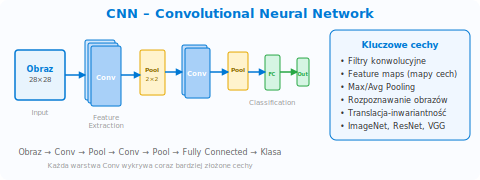 |
| | 2. **RNN (Recurrent Neural Network)** – dane sekwencyjne, tekst, szeregi czasowe |
| | 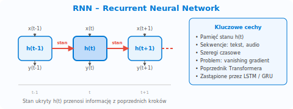 |
| | 3. **LSTM (Long Short-Term Memory)** – ulepszona RNN, lepsza pamięć długoterminowa |
| | 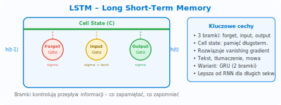 |
| | 4. **GAN (Generative Adversarial Network)** – generator + dyskryminator; tworzenie obrazów, deepfake |
| | 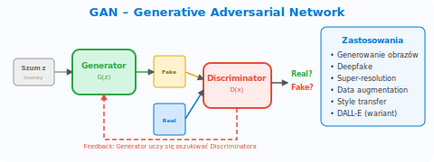 |
| | 5. **Autoencoder** – kompresja i rekonstrukcja danych; anomaly detection, denoising |
| | 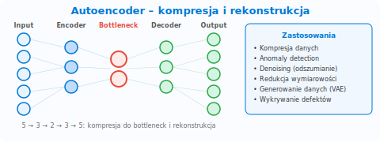 |
| | 6. **Transformer** – mechanizm attention; podstawa GPT, BERT (najważniejsza na egzaminie) |
| | 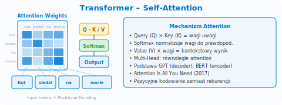 |
| **Supervised Learning** | Uczenie nadzorowane (dane z etykietami) |
| **Unsupervised Learning** | Uczenie nienadzorowane (grupowanie bez etykiet) |
| **Reinforcement Learning** | Uczenie ze wzmocnieniem (nagrody i kary) |
| **Weights (wagi)** | Parametry modelu neuronowego aktualizowane podczas treningu; definiują siłę połączeń między neuronami |
| **Activation Function** | Funkcja aktywacji w neuronach wprowadzająca nieliniowość do modelu |
| | 1. **ReLU (Rectified Linear Unit)** – najczęstsza; f(x)=max(0,x); szybka, prosta |
| | 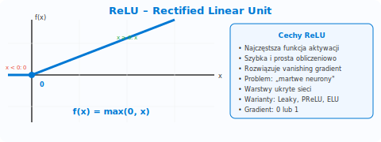 |
| | 2. **Sigmoid** – wyjście 0–1; używana w klasyfikacji binarnej (warstwa wyjściowa) |
| | 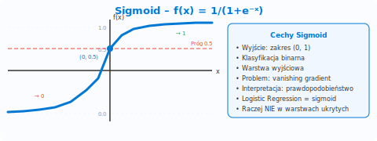 |
| | 3. **Tanh** – wyjście -1 do 1; lepsza od Sigmoid w warstwach ukrytych |
| | 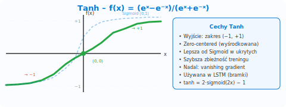 |
| | 4. **Softmax** – normalizuje wyjścia do prawdopodobieństw (suma=1); klasyfikacja wieloklasowa |
| | 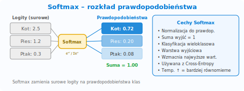 |
| | 5. **Leaky ReLU** – wariant ReLU; przepuszcza małe wartości ujemne (zapobiega „martwym neuronom") |
| | 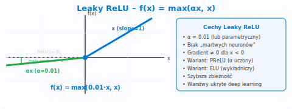 |
| **Parameters (parametry modelu)** | Całkowita liczba wag i bias'ów w modelu (np. GPT-4 ma setki miliardów parametrów) |

### **Architektura Transformer i modele językowe**

| **Pojęcie** | **Opis** |
|---|---|
| **Transformer** | Nowoczesna architektura sieci neuronowej (podstawa GPT, BERT); korzysta z mechanizmu self-attention |
| **Self-Attention** | Mechanizm pozwalający modelowi oceniać ważność każdego tokenu w kontekście pozostałych |
| **Positional Encoding** | Kodowanie pozycji tokenu w sekwencji; pozwala Transformerowi rozumieć kolejność słów |
| **Encoder / Decoder** | Komponenty Transformer: encoder przetwarza wejście (np. BERT), decoder generuje wyjście (np. GPT) |
| **LLM (Large Language Model)** | Duży model językowy (np. GPT-4) trenowany na ogromnych zbiorach tekstu |
| **Foundation Model** | Duży, wstępnie wytrenowany model AI, który można adaptować do wielu zadań (np. GPT, BERT, DALL-E) |
| **SLM (Small Language Model)** | Mały model językowy (np. Microsoft Phi-3) – mniej parametrów, szybszy, tańszy, idealny do urządzeń edge |
| **Multi-Head Attention** | Wiele równoległych mechanizmów attention w Transformer; każdy uczy się innych zależności między tokenami |
| **RNN / LSTM** | Recurrent Neural Networks / Long Short-Term Memory – starsze architektury sekwencyjne, poprzedniki Transformera |
| **BERT** | Bidirectional Encoder Representations from Transformers – model encoder do analizy tekstu (NER, sentyment, Q&A) |
| **GPT** | Generative Pre-trained Transformer – model decoder do generowania tekstu (chatboty, treści, kod) |

### **Zadania ML i typy problemów**

| **Pojęcie** | **Opis** |
|---|---|
| **Regresja (Regression)** | Przewidywanie wartości liczbowych |
| | 1. **Linear Regression** – prosta liniowa |
| |  |
| | 2. **Multiple Linear Regression** – wiele cech |
| |  |
| | 3. **Polynomial Regression** – krzywa |
| |  |
| | 4. **Decision Tree / Random Forest Regression** – drzewa decyzyjne |
| |  |
| | 5. **Neural Network Regression** – sieci neuronowe |
| |  |
| **Klasyfikacja (Classification)** | Przypisywanie do kategorii |
| | 1. **Logistic Regression** – klasyfikacja binarna (tak/nie, spam/nie-spam) |
| |  |
| | 2. **Decision Tree / Random Forest** – drzewa decyzyjne i lasy losowe |
| |  |
| | 3. **Support Vector Machine (SVM)** – separacja klas hiperpłaszczyzną |
| |  |
| | 4. **K-Nearest Neighbors (KNN)** – klasyfikacja na podstawie najbliższych sąsiadów |
| |  |
| | 5. **Neural Network Classification** – sieci neuronowe do złożonych wzorców |
| |  |
| | 6. **Naive Bayes** – klasyfikator probabilistyczny (tekst, spam) |
| |  |
| **Klasteryzacja (Clustering)** | Grupowanie podobnych danych (uczenie nienadzorowane) |
| | 1. **K-Means** – podział na k klastrów wg średnich odległości (najczęstszy na egzaminie) |
| |  |
| | 2. **Hierarchical Clustering** – aglomeracyjne łączenie klastrów w drzewo (dendrogram) |
| |  |
| | 3. **DBSCAN** – klasteryzacja gęstościowa; wykrywa klastry o dowolnym kształcie i szum |
| |  |
| | 4. **Mean Shift** – iteracyjnie przesuwa centroidy do obszarów najwyższej gęstości |
| |  |
| | 5. **Gaussian Mixture Models (GMM)** – klastry jako rozkłady prawdopodobieństwa (miękkie przypisanie) |
| |  |
| **Anomaly Detection** | Wykrywanie obserwacji odbiegających od normy (np. oszustwa, defekty, awarie) |
| | 1. **One-class SVM** – uczy się granic normalnych danych, identyfikuje obserwacje poza nimi |
| |  |
| | 2. **Isolation Forest** – losowe podziały; anomalie łatwiejsze do izolacji |
| |  |
| | 3. **Autoencoder** – sieć neuronowa ucząca się rekonstrukcji; wysoki błąd = anomalia |
| |  |
| | 4. **Statistical Methods (Z-score, IQR)** – progi statystyczne wykrywające outlierów |
| |  |
| | 5. **Azure Anomaly Detector** – gotowa usługa do wykrywania anomalii w szeregach czasowych |
| |  |
| **Recommendation Systems** | Systemy rekomendacji przewidujące preferencje użytkownika (Collaborative Filtering, Content-Based, Hybrid) |
| **Collaborative Filtering** | Rekomendacje bazujące na podobieństwie użytkowników: „użytkownicy podobni do ciebie polubili…" |
| **Content-Based Filtering** | Rekomendacje porównujące cechy produktów: „produkty podobne do tych, które lubisz" |
| **Time Series Forecasting** | Prognozowanie wartości w czasie (sprzedaż, temperatura); obsługiwane przez AutoML |
| **One-class SVM** | Algorytm anomaly detection: uczy się granic normalnych danych, identyfikuje obserwacje poza nimi |
| **Isolation Forest** | Algorytm anomaly detection oparty na losowych podziałach; anomalie łatwiejsze do izolacji |

### **Dane, cechy i trening modelu**

| **Pojęcie** | **Opis** |
|---|---|
| **Feature (cecha)** | Pojedyncza właściwość lub atrybut wykorzystywany przez model ML do nauki (np. wiek, płeć, liczba transakcji) |
| **Label (etykieta)** | Prawidłowa odpowiedź przypisana do przykładu w uczeniu nadzorowanym (np. spam/nie-spam) |
| **Feature Engineering** | Przygotowanie i wybór cech |
| **Data Labeling** | Etykietowanie danych |
| **Training Set** | Zbiór danych do trenowania modelu (~70–80% danych); dane z etykietami (supervised) lub bez (unsupervised) – np. tabele CSV, obrazy, tekst, audio |
| **Validation Set** | Zbiór do oceny modelu podczas treningu i doboru hiperparametrów (~10–15%) |
| **Test Set** | Zbiór do końcowej, niezależnej oceny modelu (~10–15%) |
| **Data Imbalance** | Nierównomierny rozkład klas w zbiorze danych (np. 95% klasy A, 5% klasy B) |
| **Class Weighting** | Przypisanie wyższych wag mniejszościowej klasie, by model lepiej ją rozpoznawał |
| **SMOTE** | Synthetic Minority Over-Sampling Technique – syntetyczne generowanie przykładów klasy mniejszościowej |
| **Stratified Split** | Podział danych z zachowaniem proporcji klas w każdym zbiorze |
| **Data Augmentation** | Sztuczne zwiększanie liczby przykładów przez modyfikacje danych |
| | 1. **Obraz: Flip / Rotation** – odbicie lustrzane, obrót |
| | 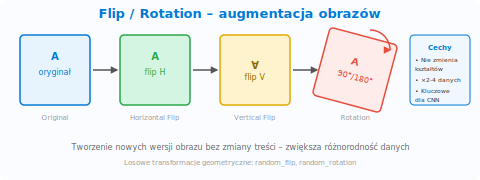 |
| | 2. **Obraz: Crop / Resize** – wycinanie fragmentów, zmiana rozmiaru |
| | 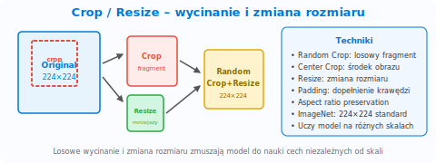 |
| | 3. **Obraz: Color Jitter** – losowe zmiany jasności, kontrastu, nasycenia |
| | 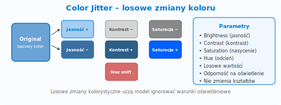 |
| | 4. **Tekst: Synonym Replacement** – zamiana słów na synonimy |
| | 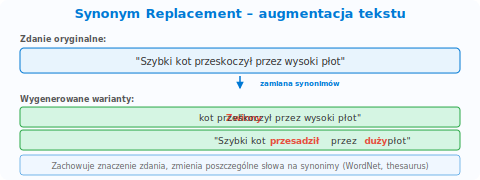 |
| | 5. **Tekst: Back-Translation** – tłumaczenie na inny język i z powrotem |
| | 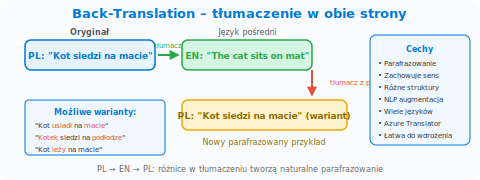 |
| **Normalization** | Skalowanie wartości cech do wspólnego zakresu (np. 0–1); ważne dla algorytmów opartych na odległościach |
| **One-hot Encoding** | Zamiana kategorii na wektory binarne (np. kolor: czerwony → [1,0,0], zielony → [0,1,0]) |

### **Proces trenowania i optymalizacja**

| **Pojęcie** | **Opis** |
|---|---|
| **Inference (wnioskowanie)** | Użycie wytrenowanego modelu do generowania predykcji na nowych danych |
| **Hyperparameter (hiperparametr)** | Parametr ustawiany przed treningiem (np. learning rate, liczba epok), w odróżnieniu od wag uczonych automatycznie |
| **Epoch (epoka)** | Jedno pełne przejście przez cały zbiór treningowy podczas trenowania modelu |
| **Loss Function (funkcja straty)** | Miara błędu modelu; cel treningu to jej minimalizacja |
| | 1. **MSE (Mean Squared Error)** – regresja; średnia kwadratów błędów |
| | 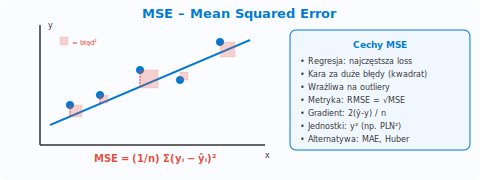 |
| | 2. **Cross-Entropy (Log Loss)** – klasyfikacja; mierzy różnicę między przewidywanym a rzeczywistym rozkładem |
| | 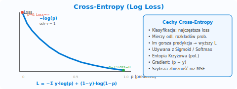 |
| | 3. **Binary Cross-Entropy** – klasyfikacja binarna (2 klasy) |
| | 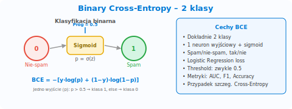 |
| | 4. **Categorical Cross-Entropy** – klasyfikacja wieloklasowa |
| | 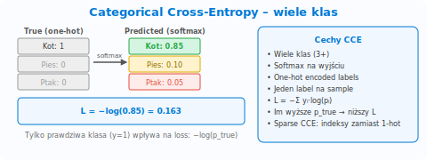 |
| | 5. **MAE (Mean Absolute Error)** – regresja; mniej wrażliwa na outliery niż MSE |
| | 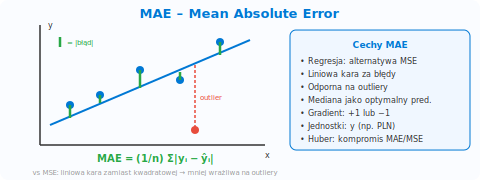 |
| **Gradient Descent** | Algorytm optymalizacji minimalizujący funkcję straty poprzez iteracyjne dopasowywanie wag |
| **Backpropagation** | Mechanizm propagacji błędu wstecz w sieci neuronowej, do obliczania gradientów i aktualizacji wag |
| **Regularization** | Techniki zapobiegające overfittingowi |
| | 1. **L1 (Lasso)** – dodaje sumę wart. bezwzględnych wag do loss; zeruje nieistotne cechy (feature selection) |
| | 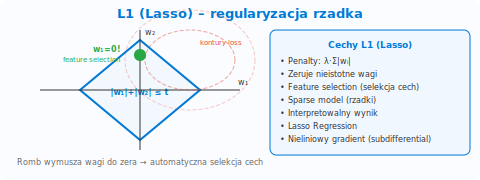 |
| | 2. **L2 (Ridge)** – dodaje sumę kwadratów wag do loss; zmniejsza wagi, ale nie zeruje |
| | 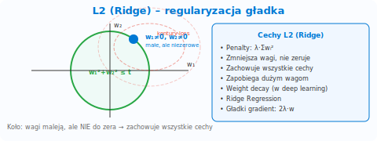 |
| | 3. **Elastic Net** – kombinacja L1 + L2 |
| | 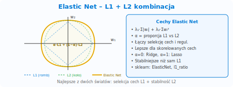 |
| | 4. **Dropout** – losowe wyłączanie neuronów podczas treningu; zapobiega współzależności |
| | 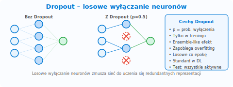 |
| | 5. **Early Stopping** – zatrzymanie treningu, gdy metryka walidacyjna przestaje się poprawiać |
| | 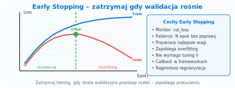 |
| **Overfitting (przeuczenie)** | Model zbyt dobrze dopasowany do danych treningowych; świetne wyniki na treningu, słabe na nowych danych |
| **Underfitting (niedouczenie)** | Model zbyt prosty, nie wychwytuje wzorców; słabe wyniki zarówno na treningu, jak i na nowych danych |
| **Transfer Learning** | Wykorzystanie modelu wytrenowanego na jednym zadaniu do przyspieszenia nauki na innym |
| **Cross-Validation (K-fold)** | Wielokrotny podział danych na k zbiorów; każdy pełni rolę testu raz – bardziej stabilna ocena modelu |
| **Inference Pipeline** | Pipeline wnioskowania utworzony z training pipeline; wymagany przed wdrożeniem modelu do produkcji |
| **Pipeline ML** | Sekwencja kroków przetwarzania danych i trenowania modelu |

### **Metryki oceny modeli**

| **Pojęcie** | **Opis** |
|---|---|
| **True Positive (TP)** | Przypadek poprawnie zaklasyfikowany jako pozytywny |
| **False Positive (FP)** | Przypadek błędnie zaklasyfikowany jako pozytywny (fałszywy alarm) |
| **True Negative (TN)** | Przypadek poprawnie zaklasyfikowany jako negatywny |
| **False Negative (FN)** | Przypadek błędnie zaklasyfikowany jako negatywny (przeoczenie) |
| **Accuracy** | Dokładność – odsetek poprawnych przewidywań |
| **Precision** | Precyzja – odsetek trafień wśród przewidzianych pozytywnych |
| **Recall** | Czułość – odsetek wykrytych pozytywnych |
| **F1-score** | Średnia harmoniczna Precision i Recall |
| **Confusion Matrix** | Macierz pomyłek – tabela TP/FP/TN/FN |
| **ROC Curve, AUC** | Krzywa ROC i pole pod krzywą – ocena klasyfikatora binarnego |
| **MSE (Mean Square Error)** | Średnia kwadratów różnic między wartościami rzeczywistymi a przewidywanymi |
| **R² (R-Squared)** | Współczynnik determinacji; metryka regresji od 0 do 1 (1.0 = model idealny) |
| **MAE (Mean Absolute Error)** | Średnia wartość bezwzględna błędów predykcji |
| **RMSE (Root Mean Square Error)** | Pierwiastek z MSE; metryka w tych samych jednostkach co zmienna docelowa |
| **Metryki wg typu zadania (egzamin!)** | **Classification:** Accuracy, Precision, Recall, F1, AUC, Confusion Matrix   **Regression:** MSE, MAE, RMSE, R²   **Clustering:** Silhouette Score, Average Distance to Cluster Center |

### **Computer Vision**

| **Pojęcie** | **Opis** |
|---|---|
| **Computer Vision** | Analiza i interpretacja obrazów/wideo |
| **Image Classification** | Klasyfikacja obrazów – co jest na obrazie |
| | 1. **Binary Classification** – dwie kategorie (np. kot/pies, zdrowy/chory) |
| | 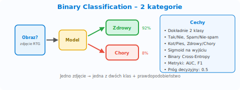 |
| | 2. **Multi-class Classification** – wiele kategorii, jeden label na obraz (np. kot, pies, ptak) |
| | 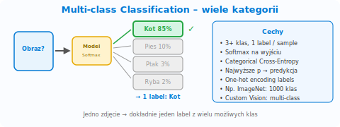 |
| | 3. **Multi-label Classification** – wiele tagów na obraz (np. „plaża" + „zachód słońca" + „ludzie") |
| | 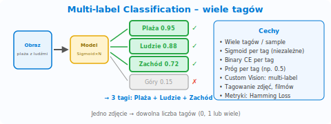 |
| **Object Detection** | Detekcja obiektów – klasa + prawdopodobieństwo + bounding box |
| | 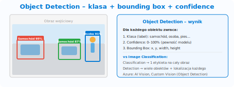 |
| **Bounding Box** | Prostokąt otaczający wykryty obiekt na obrazie (x, y, szerokość, wysokość) |
| **OCR (Optical Character Recognition)** | Rozpoznawanie tekstu na obrazach |
| | 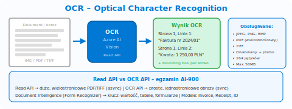 |
| **Semantic Segmentation** | Klasyfikacja każdego piksela obrazu do kategorii (np. droga, budynek, niebo) |
| | 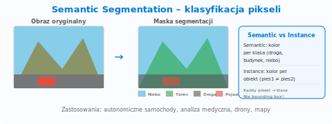 |
| **Instance Segmentation** | Segmentacja z rozróżnianiem instancji – każdy obiekt ma unikalny ID (pies1 ≠ pies2) |
| | 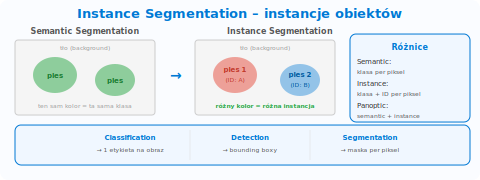 |
| **Image Tagging / Captioning** | Automatyczne generowanie tagów i opisów obrazu w języku naturalnym (Azure Vision) |
| | 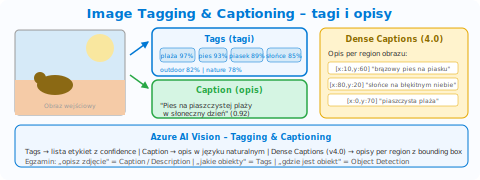 |
| **Dense Captions** | Generowanie wielu opisów dla różnych regionów jednego obrazu (Azure Vision 4.0 – Image Analysis) |
| **Smart Cropping** | Inteligentne kadrowanie obrazu z zachowaniem najważniejszych elementów (aspect ratio); Azure Vision 4.0 |
| **Background Removal** | Usunięcie lub zamiana tła obrazu na przezroczyste; Azure Vision 4.0 (Segment API) |
| **Depth Estimation** | Szacowanie głębokości sceny z obrazu 2D – mapa odległości (Azure Vision 4.0) |
| | 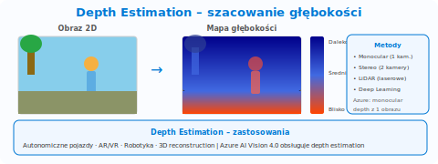 |
| **Image Embeddings** | Wektorowa reprezentacja obrazu do wyszukiwania podobnych (Azure Vision 4.0 – vectorize endpoint) |
| | 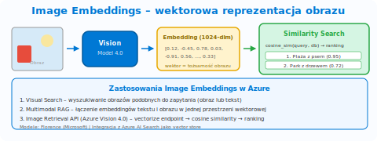 |
| **Video Analysis** | Analiza wideo: śledzenie obiektów, detekcja scen, ekstrakcja metadanych (Azure Video Indexer) |
| | 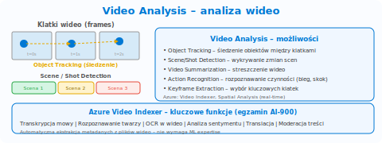 |
| **Face Recognition** | Rozpoznawanie twarzy |
| | 1. **Face Detection** – wykrywanie twarzy na obrazie + atrybuty (wiek, okulary, emocje) |
| | 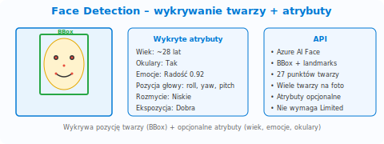 |
| | 2. **Face Verification** – porównanie 1:1 – „czy to ta sama osoba?" |
| | 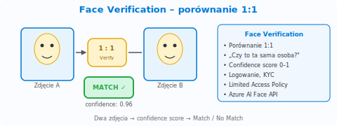 |
| | 3. **Face Identification** – porównanie 1:N – „kto to jest?" (wymaga PersonGroup) |
| | 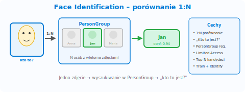 |
| | 4. **Face Grouping** – grupowanie podobnych twarzy ze zbioru zdjęć |
| | 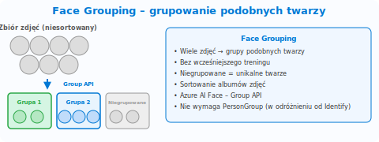 |
| | 5. **Find Similar** – wyszukiwanie twarzy podobnych do podanej |
| | 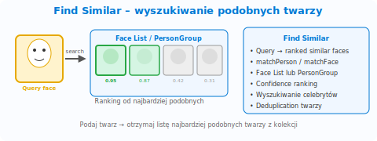 |
| **Face Liveness Detection** | Wykrywanie żywej osoby (ochrona przed atakami zdjęciowymi / deepfake) – Limited Access |
| **PersonGroup** | Grupa osób w Face API z wieloma zdjęciami; wymagana do Face Identification |
| **Limited Access Policy** | Niektóre funkcje AI (identyfikacja twarzy) wymagają formalnej zgody Microsoft |
| **Read API** | API Azure Vision do odczytu tekstu z dużych, wielostronicowych PDF (vs OCR API dla prostych obrazów) |
| **Spatial Analysis** | Śledzenie ruchu osób, liczenie w strefach, mierzenie dystansów w wideo real-time – Azure Vision |
| | 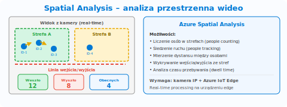 |

### **NLP (Natural Language Processing)**

| **Pojęcie** | **Opis** |
|---|---|
| **NLP** | Przetwarzanie języka naturalnego |
| **Tokenizacja (Tokenization)** | Dzielenie tekstu na słowa/elementy |
| **Lematyzacja (Lemmatization)** | Sprowadzanie słów do formy podstawowej |
| **Stemming** | Obcinanie końcówek słów do rdzenia; normalizacja tekstu przed analizą częstości |
| **Embeddingi (Embeddings)** | Reprezentacja tekstu w postaci wektorów liczbowych |
| | 1. **Word2Vec** – klasyczny; każde słowo = jeden wektor (nie rozróżnia kontekstu) |
| | 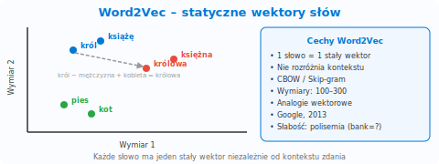 |
| | 2. **GloVe** – Global Vectors; wektory na bazie statystyk współwystępowania słów |
| | 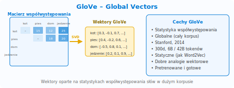 |
| | 3. **BERT Embeddings** – kontekstowe; to samo słowo ma różny wektor zależnie od zdania |
| | 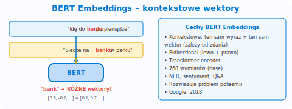 |
| | 4. **OpenAI text-embedding** – modele embeddingów Azure OpenAI (text-embedding-ada, text-embedding-3) do RAG i wyszukiwania semantycznego |
| | 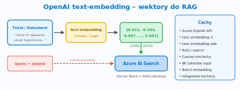 |
| **Entity Recognition (NER)** | Rozpoznawanie encji nazwanych (osoby, miejsca, organizacje, daty) |
| | 1. **Person** (imiona, nazwiska)   2. **Location** (miasta, kraje, adresy)   3. **Organization** (firmy, instytucje)   4. **DateTime** (daty, godziny, okresy)   5. **Quantity** (liczby, procenty, waluty)   6. **Email** (adresy e-mail)   7. **URL** (adresy internetowe)   8. **IP Address** (adresy IP)   9. **Phone Number** (numery telefonów) |
| **Entity Linking** | Identyfikacja encji + powiązanie z bazą wiedzy (np. Wikipedia); różni się od NER linkami |
| **PII Detection** | Wykrywanie danych osobowych w tekście przez **Azure AI Language** – usługa zwraca w odpowiedzi API **redacted text** z PII zastąpionym znakami `*****` (lub wybranym znakiem maskującym). Kategorie: imiona, SSN, nr karty kredytowej, email, telefon, adres, PESEL. Aplikacja nie musi maskować sama – API zwraca gotowy zamaskowany tekst + listę wykrytych encji z pozycjami i confidence score |
| **Sentiment Analysis** | Analiza sentymentu (pozytywny, negatywny, neutralny, mieszany) |
| **Key Phrase Extraction** | Wyodrębnianie najważniejszych fraz i słów kluczowych z tekstu |
| **Summarization** | Automatyczne streszczanie długich dokumentów lub transkrypcji rozmów |
| **Language Detection** | Automatyczne rozpoznawanie języka tekstu |
| **Intent Recognition** | Rozpoznawanie intencji użytkownika (np. w chatbocie) |
| **CLU** | Conversational Language Understanding – następca LUIS; rozpoznawanie intencji i encji |
| **Utterance** | Wypowiedź użytkownika przekazywana do modelu NLP (np. „Zarezerwuj lot do Paryża na jutro") |
| **Intent** | Intencja – zamiar użytkownika rozpoznany z utterance (np. BookFlight) |
| **Entity** | Encja wyodrębniona z utterance – konkretna wartość (np. miasto=Paryż, data=jutro) |
| **Conversational AI Flow** | Utterance → Intent Recognition → Entity Extraction → Response – egzaminowy przepływ CLU |
| **Multi-turn Conversation** | Rozmowa wieloturowa – chatbot utrzymuje kontekst między kolejnymi wypowiedziami użytkownika (historia konwersacji) |
| **Question Answering** | Usługa tworzenia baz wiedzy Q&A z dokumentów, FAQ i stron internetowych |
| **Active Learning (Q&A)** | System sugeruje nowe pary pytanie-odpowiedź na podstawie zapytań użytkowników; poprawia bazę wiedzy bez ręcznego dodawania – Custom Question Answering |
| **Speech Recognition** | Rozpoznawanie mowy (Speech-to-Text) |
| **Speech Synthesis** | Synteza mowy z tekstu (Text-to-Speech) |
| **SSML (Speech Synthesis Markup Language)** | Język znaczników do kontroli TTS: pauzy, intonacja, szybkość, głośność, wybór głosu i języka – XML-based |
| **Speech Translation** | Tłumaczenie mowy w czasie rzeczywistym: speech-to-text + translation + text-to-speech |
| **Speaker Recognition** | Identyfikacja/weryfikacja osoby na podstawie głosu (kto mówi, nie co mówi) |
| **Custom Speech** | Dostosowanie modelu STT do własnego słownictwa, akcentu lub domeny (np. medyczna) |
| **Custom Voice** | Tworzenie spersonalizowanego, syntetycznego głosu TTS |
| **Custom Neural Voice** | Zaawansowana wersja Custom Voice z naturalnym brzmieniem; wymaga **Limited Access** (wniosek do Microsoft) |
| **Pronunciation Assessment** | Ocena poprawności wymowy w Speech Service: accuracy, fluency, completeness, prosody score – scenariusz nauki języków |
| **Keyword Recognition** | Rozpoznawanie słowa kluczowego on-device (wake word, np. „Hey Cortana"); niskie opóźnienie, działa offline na urządzeniu edge |
| **Custom Translator** | Dostosowanie modelu tłumaczenia do specjalistycznego słownictwa (prawo, medycyna) |
| **Transliteration** | Zmiana alfabetu bez tłumaczenia (np. arabski → łaciński); Azure Translator, ~20 języków |
| **Batch Transcription** | Masowa, asynchroniczna transkrypcja dużych zbiorów nagrań audio – Azure Speech |

### **Generatywna AI**

| **Pojęcie** | **Opis** |
|---|---|
| **Generative AI** | AI tworzaca **nowe treści** (tekst, obrazy, kod) z promptów – w odróżnieniu od Traditional AI, która **analizuje** dane i zwraca predykcje (etykiety/liczby), GenAI **generuje** oryginalne outputy |
| | 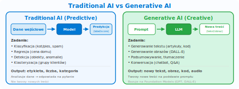 |
| **Multimodal Models** | Modele przetwarzające jednocześnie tekst, obraz i audio (np. GPT-4o) |
| **DALL-E** | Model generowania obrazów z promptów tekstowych (text-to-image); DALL-E 3 w Azure OpenAI |
| **Whisper** | Model transkrypcji audio na tekst (speech-to-text); dostępny w Azure OpenAI i Azure AI Speech |
| **Codex** | Model generowania kodu z języka naturalnego; bazowy dla GitHub Copilot |
| **Prompt** | Polecenie lub zapytanie przekazywane do modelu generatywnego |
| **Token** | Najmniejsza jednostka tekstu przetwarzana przez model językowy (~¾ słowa) |
| **Prompt Engineering** | Tworzenie skutecznych poleceń dla modeli generatywnych |
| | 1. **Zero-shot** – bez przykładów; model radzi sobie sam |
| | 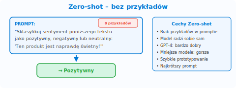 |
| | 2. **One-shot** – jeden przykład w promptie |
| | 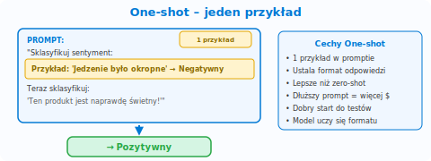 |
| | 3. **Few-shot** – kilka przykładów (1–5) w promptie |
| |  |
| | 4. **Chain-of-Thought (CoT)** – krok po kroku; poprawia rozumowanie |
| |  |
| | 5. **System Message** – instrukcja definiująca rolę i ograniczenia modelu |
| |  |
| | 6. **Retrieval Augmented Generation (RAG)** – wzbogacenie promptu danymi z bazy wiedzy |
| |  |
| **Zero-shot learning** | Model radzi sobie z zadaniem, którego nie widział podczas treningu |
| **Few-shot learning** | Model uczy się na bardzo małej liczbie przykładów (1–5 w promptie) |
| **Chain-of-Thought** | Technika zachęcająca model do wypisania kroków rozumowania (poprawia dokładność) |
| **System Message** | Instrukcja na początku sesji definiująca rolę, ton i ograniczenia modelu |
| **Temperature** | Parametr losowości: 0 = deterministyczny, 1+ = kreatywny |
| **Top-p (Nucleus Sampling)** | Alternatywny parametr kontrolujący różnorodność odpowiedzi |
| **Context Window** | Maksymalna liczba tokenów przetwarzana jednorazowo przez model (np. 128k dla GPT-4o) |
| **Fine-tuning** | Dodatkowe trenowanie pre-trenowanego modelu na własnych danych |
| **MaaS (Model as a Service)** | Serverless API – wdrożenie modelu bez zarządzania infrastrukturą, płatność per token (vs Managed Compute = dedykowane GPU, per hour) |
| |  |
| **Azure OpenAI Deployment Types** | 1. **Standard** – shared compute, TPM/RPM quota, najczęstszy   2. **Provisioned (PTU)** – dedykowana przepustowość, stała opłata   3. **Global** – routing między regionami, najlepsza dostępność |
| **Azure OpenAI Playground** | Interaktywne środowisko testowe w portalu:   1. **Chat** – rozmowa z modelem   2. **Completions** – uzupełnianie tekstu   3. **Assistants** – agenci z narzędziami   Idealne do prototypowania |
| **Azure OpenAI vs OpenAI (publiczny)** | Na egzaminie! Różnice:   1. Dane klientów **NIE** są używane do trenowania modeli Microsoft/OpenAI   2. VNet, Private Endpoint, compliance (RODO, HIPAA, SOC2)   3. Content Filters domyślnie włączone   4. Te same modele, ale managed i zabezpieczone przez Microsoft   5. Wymaga zatwierdzenia dostępu |
| **Azure OpenAI Data Privacy** | „Your data is your data" – dane wysyłane do Azure OpenAI **nie trafiają** do OpenAI, nie są używane do trenowania modeli, nie są udostępniane innym klientom. Dane przetwarzane w wybranym regionie Azure |
| **Azure OpenAI Abuse Monitoring** | Wszystkie requesty logowane na 30 dni; Microsoft może przeglądać flagowane żądania; można wnioskować o wyłączenie dla zatwierdzonych scenariuszy |
| **Model Versioning (Azure OpenAI)** | Modele mają wersje (np. `0613`, `1106`, `turbo-2024-04-09`); Microsoft podaje daty wycofania (retirement); auto-upgrade do nowszej wersji jeśli nie zaktualizujesz ręcznie |
| **RAG (Retrieval Augmented Generation)** | Retrieval Augmented Generation – łączy LLM z zewnętrznymi źródłami danych zamiast polegać na wiedzy treningowej. Pipeline: dokumenty → chunking → embedding → vector index (Azure AI Search); pytanie → embed query → similarity search → top-K docs + prompt → LLM → grounded answer. Korzyści: aktualne dane, mniej halucynacji, cytowanie źródeł, brak potrzeby fine-tuningu. Na egzaminie: RAG to **najważniejsza technika** redukcji halucynacji |
| |  |
| **Grounding (zakotwiczenie)** | Powiązanie odpowiedzi modelu z konkretnymi, zweryfikowanymi dokumentami |
| **Hallucinations** | Generowanie nieprawdziwych informacji przez model – najczęściej pytany problem GenAI na egzaminie |
| |  |
| | 1. **Factual Hallucination** – fałszywe fakty, daty, nazwiska (np. „stolica Australii to Sydney") |
| |  |
| | 2. **Fabrication** – zmyślone źródła, cytaty, artykuły naukowe, URL-e (wyglądają wiarygodnie!) |
| |  |
| | 3. **Instruction Hallucination** – model ignoruje System Message, format, język, ograniczenia |
| |  |
| | 4. **Context Hallucination** – odpowiedź sprzeczna z dostarczonym kontekstem (RAG/dokument) |
| |  |
| | 5. **Autocomplete Hallucination** – generuje token „bo statystycznie pasuje", nie sprawdza prawdziwości |
| |  |
| **Content Filters** | Mechanizmy Azure OpenAI blokujące szkodliwe treści |
| | 1. **Hate (nienawiść)** – mowa nienawiści, dyskryminacja grup |
| |  |
| | 2. **Violence (przemoc)** – treści promujące przemoc fizyczną |
| |  |
| | 3. **Sexual (treści seksualne)** – treści dla dorosłych |
| |  |
| | 4. **Self-harm (samookaleczenie)** – treści promujące samookaleczenie |
| |  |
| | 5. **Jailbreak detection** – wykrywanie prób obejścia ograniczeń modelu |
| |  |
| | Severity levels: Safe, Low, Medium, High |
| **Prompt Injection** | Atak polegający na wstrzyknięciu złośliwych instrukcji w danych wejściowych |
| **XPIA** | Cross-Prompt Injection Attacks – atak przez wstrzyknięcie instrukcji w jedno ze źródeł RAG agenta |
| **Hybrid Search** | Kombinacja vector search (semantyka) + keyword search (dokładne słowa) – lepsze wyniki niż każde osobno |
| **Vector Store** | Baza danych przechowująca embeddingi; Azure AI Search pełni rolę vector store dla RAG |
| **Chunking** | Dzielenie dużych dokumentów na mniejsze fragmenty przed osadzeniem w embeddings; kluczowe dla RAG |
| **Integrated Vectorization** | Automatyczne konwertowanie dokumentów na embeddingi w Azure AI Search |

### **Modele w Azure OpenAI – tabela (egzamin!)**

| **Model** | **Typ** | **Zastosowanie** |
|---|---|---|
| **GPT-4o / GPT-4** | Text generation | Chat, generowanie tekstu, kod, rozumowanie, analiza obrazów (multimodal) |
| **GPT-3.5 Turbo** | Text generation | Szybszy i tańszy chat/tekst; mniej zaawansowany niż GPT-4 |
| **DALL-E 3** | Image generation | Generowanie obrazów z opisów tekstowych (text-to-image) |
| **Whisper** | Speech-to-text | Transkrypcja audio na tekst |
| **text-embedding-3-large** | Embeddings | Wektorowa reprezentacja tekstu do RAG i wyszukiwania semantycznego |
| **Phi-3 / Phi-4** | SLM (Small LM) | Mniejsze modele Microsoftu; tańsze, szybsze, dobre do edge i fine-tuningu |

### **Responsible AI i etyka**

| **Pojęcie** | **Opis** |
|---|---|
| **Responsible AI** | Etyczne i bezpieczne wdrażanie AI |
| | 1. **Fairness** – sprawiedliwość, równe traktowanie   2. **Reliability & Safety** – niezawodność i bezpieczeństwo   3. **Privacy & Security** – ochrona danych   4. **Inclusiveness** – dostępność dla wszystkich   5. **Transparency** – przejrzystość działania   6. **Accountability** – odpowiedzialność ludzi za systemy AI |
| **Fairness** | Sprawiedliwość, równe traktowanie grup |
| **Reliability & Safety** | Model działa poprawnie w różnych warunkach; nie powoduje szkody; testowany pod kątem edge cases |
| **Inclusiveness** | AI dostępne dla wszystkich, w tym osób z niepełnosprawnościami; brak dyskryminacji |
| **Transparency** | Użytkownicy wiedzą, że mają do czynienia z AI; rozumieją jak model podejmuje decyzje |
| **Accountability** | Ludzie ponoszą odpowiedzialność za systemy AI; wymagane governance, audit, oversight |
| **Bias** | Tendencyjność modelu wynikająca z danych |
| **Explainability** | Wyjaśnialność decyzji modelu |
| **Interpretability** | Możliwość zrozumienia, jak model podejmuje decyzje |
| **Compliance** | Zgodność z regulacjami (np. RODO/GDPR) |
| **Data Privacy** | Ochrona prywatności i bezpieczeństwa danych |
| **SHAP** | SHapley Additive exPlanations – technika pokazująca wpływ każdej cechy na predykcję modelu |
| **LIME** | Local Interpretable Model-agnostic Explanations – lokalne wyjaśnienia decyzji modelu |
| **Feature Importance** | Ranking cech wg wpływu na wynik modelu; obliczany przez SHAP/LIME |
| **Fairlearn** | Open-source narzędzie do pomiaru i poprawy sprawiedliwości modeli; w Azure ML RAI Dashboard |
| **Error Analysis** | Analiza błędów modelu pogrupowana wg cech/podgrup; diagnoza biasu – Azure ML RAI Dashboard |
| **Causal Analysis** | Analiza przyczynowości: „czy zmiana X powoduje zmianę Y?" (nie tylko korelacja) |
| **Counterfactual** | Kontrfaktyczne przykłady: „jak zmieniłby się wynik, gdyby…" – wyjaśnienie alternatywnych scenariuszy |
| **Responsible AI Dashboard** | Zintegrowany panel w Azure ML łączący: Error Analysis, Fairlearn, SHAP, Causal Analysis, Counterfactuals – jedno miejsce do analizy modelu |
| **Human-in-the-Loop** | Człowiek w pętli decyzyjnej – kluczowa zasada RAI: AI wspiera, ale człowiek podejmuje ostateczną decyzję (zwłaszcza w medycynie, prawie, finansach) |
| **Responsible AI Impact Assessment** | Microsoft wymaga oceny wpływu AI przed wdrożeniem: identyfikacja ryzyk, potencjalnych szkód i grup dotkniętych |

### **Cykl życia modelu i MLOps**

| **Pojęcie** | **Opis** |
|---|---|
| **Model Deployment** | Wdrożenie modelu do środowiska produkcyjnego |
| **Model Registry** | Repozytorium modeli z wersjonowaniem, metadanymi i metrykami |
| **Endpoint** | Punkt dostępu do wdrożonego modelu przez REST API (Online = real-time, Batch = wsadowy) |
| **Online Endpoint (Real-time)** | Inferencing w czasie rzeczywistym; odpowiedź w milisekundach; do aplikacji interaktywnych (chatbot, API) |
| **Batch Endpoint** | Przetwarzanie dużych zbiorów danych wsadowo (np. co noc); wyniki zapisywane w storage; tańszy |
| **Monitoring** | Śledzenie skuteczności i działania modelu po wdrożeniu |
| **Drift** | Zmiana rozkładu danych wejściowych/wyjściowych w czasie, pogarszająca skuteczność modelu |
| **Data Drift** | Zmiana rozkładu danych wejściowych w produkcji – najpowszechniejszy typ driftu na egzaminie |
| **Model Drift** | Pogorszenie metryki predykcyjnej (accuracy, precision) na nowych danych |
| **Prediction Drift** | Nagła zmiana przewidywań modelu bez zmian w danych wejściowych |
| **Retraining** | Ponowne trenowanie modelu na nowych danych |
| **Traffic Split (A/B Test)** | Podział ruchu użytkowników między model A i B; stopniowy rollout (10% → 50% → 100%) |
| **MLOps** | Praktyki DevOps dla modeli ML: CI/CD, wersjonowanie, monitoring, automatyczny retraining |
| **Audit Trail** | Pełna historia: kto trenował model, kiedy, z jakimi danymi, jakie wyniki – compliance |
| **Jobs w Azure ML** | 1. **Command Job** – uruchamianie skryptu trenującego   2. **Pipeline Job** – wielokrokowy workflow   3. **Sweep Job** – automatyczne przeszukiwanie hiperparametrów |

### **Narzędzia i usługi Azure**

| **Pojęcie** | **Opis** |
|---|---|
| **Azure AI Services** | Rodzina gotowych usług AI na platformie Azure (Vision, Language, Speech, Face i inne) |
| **AutoML (Automated ML)** | Automatyczny dobór algorytmu i hiperparametrów (klasyfikacja, regresja, time series; NIE clustering) |
| **Designer** | Graficzny interfejs drag & drop w Azure ML do budowy pipeline'ów ML bez kodu |
| **Azure AI Translator** | Osobna usługa do tłumaczeń maszynowych tekstu (100+ języków) |
| **Azure AI Document Intelligence** | Ekstrakcja danych z formularzy, faktur, dokumentów (dawniej Form Recognizer) |
| **Document Intelligence – Prebuilt Models** | Gotowe modele (egzamin!):   1. **prebuilt-invoice** – faktury   2. **prebuilt-receipt** – paragony   3. **prebuilt-idDocument** – dowody, paszporty   4. **prebuilt-businessCard** – wizytówki   5. **prebuilt-layout** – tabele, tekst   Nie wymagają trenowania |
| **Prebuilt vs Custom Model** | **Prebuilt:** gotowy model od Microsoft, działa od razu (Document Intelligence, Custom Vision prebuilt)   **Custom:** trenujesz na własnych danych, gdy prebuilt nie pasuje do domeny   Egzamin: zawsze preferuj prebuilt jeśli wystarczy |
| **Custom Model Workflow (Doc Intelligence)** | Label (oznacz pola) → Train (wytrenuj model) → Test (oceń wyniki) → Deploy (wdróż do produkcji); Document Intelligence Studio do no-code |
| **Azure AI Content Safety** | Filtrowanie szkodliwych treści: mowy nienawiści, przemocy, treści seksualnych |
| **Azure AI Search** | Wektorowa baza danych i platforma wyszukiwania (indexer, index, skillset); kluczowa dla RAG |
| **Custom Vision** | Trenowanie własnych modeli klasyfikacji/detekcji obrazów bez kodu |
| **Azure Bot Service** | Usługa do budowy chatbotów; jeden bot obsługuje wiele kanałów (Web Chat, Teams, Facebook) |
| **Copilot Studio** | Platforma no-code do budowy chatbotów i agentów AI (dawniej Power Virtual Agents) |
| **Bot Service vs Copilot Studio** | **Bot Service:** dla developerów, kod w C#/JS/Python, pełna kontrola   **Copilot Studio:** no-code, użytkownicy biznesowi, szybkie prototypowanie   Egzamin: Copilot Studio = no-code, Bot Service = pro-code |
| **AI Builder** | Narzędzia AI w Power Platform dla użytkowników biznesowych |
| **Knowledge Mining** | Wydobywanie wiedzy z niestrukturyzowanych danych za pomocą AI (OCR, NLP, wzbogacanie) |
| **Knowledge Mining Pipeline** | Trójstopniowy wzorzec (egzamin!):   1. **Ingest** – źródła: Blob, SQL, Cosmos DB   2. **Enrich** – AI Skillset: OCR, NER, key phrases, language detection   3. **Explore** – Search Index, Dashboard, Power BI |
| **Vector Search** | Wyszukiwanie na bazie podobieństwa embeddingów (semantyczne, nie słowa kluczowe) |
| **AI Agents** | Aplikacje AI z LLM, instrukcjami i narzędziami, działające autonomicznie (3 typy: Prompt, Workflow, Hosted) |
| **RBAC** | Role-Based Access Control – kontrola dostępu do zasobów Azure (właściciel, współpracownik, czytelnik) |
| **Data Assets** | Zarządzanie danymi w Azure ML: rejestracja, wersjonowanie i udostępnianie zbiorów danych zespołom |
| **Compute Instance** | Maszyna wirtualna w Azure ML – do eksperymentów, notebooków, developmentu (1 użytkownik) |
| **Compute Cluster** | Skalowalne klastry obliczeniowe w Azure ML do trenowania modeli (auto-scale 0→N węzłów) |
| **Serverless Compute** | Compute on-demand bez tworzenia klastra; Azure ML automatycznie alokuje zasoby na czas Job |
| **Datastores** | Połączenia do źródeł danych w Azure ML: Blob Storage, Data Lake, Azure SQL – bezpieczne przechowywanie credentials |
| **Feature Store** | Centralne repozytorium cech ML do ponownego wykorzystania między projektami |
| **Prompt Flow** | Narzędzie w Azure AI Foundry do orkiestracji pipeline'ów AI, RAG i wielostopniowych aplikacji |
| **Model Catalog** | Centralna baza modeli w Foundry: GPT, Phi, Llama, Mistral – przeglądanie, ewaluacja, wdrażanie |
| **Azure AI Video Indexer** | Osobna usługa do analizy wideo: transkrypcja, OCR, face detection, scene detection, topic extraction |
| **Microsoft Copilot** | Asystent AI w produktach Microsoft (M365 Copilot, Bing Chat, GitHub Copilot); bazuje na GPT + Grounding |
| **Regions & Availability** | Nie wszystkie usługi AI dostępne w każdym regionie; Azure OpenAI wymaga wybrania regionu z dostępnym modelem |

### **Azure AI Foundry vs Azure Machine Learning Studio (egzamin!)**

| **Aspekt** | **Azure AI Foundry** | **Azure Machine Learning Studio** |
|---|---|---|
| **Główne zadanie** | Budowa aplikacji AI (GenAI, RAG, agenci) | Trenowanie i wdrażanie modeli ML |
| **Typowy użytkownik** | Developer AI, prompt engineer | Data scientist, ML engineer |
| **Modele** | Model Catalog (GPT, Phi, Llama) – gotowe | AutoML, Designer, własne skrypty – trenujesz sam |
| **Kluczowe narzędzia** | Prompt Flow, Playground, Model Catalog, Agents | AutoML, Designer, Jobs, Pipelines, Endpoints |
| **RAG / GenAI** | Natywne wsparcie (Prompt Flow + AI Search) | Możliwe, ale nie główny cel |
| **Kiedy wybrać** | Chcesz korzystać z gotowych modeli LLM/SLM | Chcesz trenować własne modele ML od zera |

### **Moduły Azure ML Designer (egzamin!)**

| **Pojęcie** | **Opis** |
|---|---|
| **Split Data** | Dzieli dane na zbiory treningowe i testowe; wymagany przed Score/Evaluate |
| **Normalize Data** | Skaluje kolumny numeryczne do wspólnego zakresu (Min-Max, Z-score) |
| **Clean Missing Data** | Obsługa brakujących wartości (usunięcie wierszy, średnia, mediana) |
| **Select Columns in Dataset** | Wybór konkretnych kolumn z zestawu danych do dalszego przetwarzania |
| **Train Model** | Trenowanie modelu na danych treningowych (logistic regression, decision tree itp.) |
| **Train Clustering Model** | Trenowanie modelu klasteryzacji (K-Means); oddzielny od Train Model |
| **Score Model** | Predykcja modelu na danych testowych; zwraca przewidywania |
| **Evaluate Model** | Ocena modelu (Confusion Matrix, metryki); zasilany wyjściem Score Model |
| **Assign Data to Clusters** | Przypisanie nowych danych do klastrów K-Means; do inferencing klasteryzacji (NIE Score Model!) |

### **Komponenty Azure AI Search**

| **Pojęcie** | **Opis** |
|---|---|
| **Indexer** | Eksportuje dokumenty źródłowe do JSON i wstawia je do indeksu wyszukiwania |
| **Index** | Struktura przechowująca wyszukiwalne dane; zawiera pola z atrybutami (searchable, filterable) |
| **Skillset** | Opcjonalny pipeline AI enrichment: OCR, NER, key phrase extraction, language detection |
| **Knowledge Store** | Miejsce w Azure Storage do przechowywania wzbogaconych wyników AI (tabele, blob) |
| **Semantic Ranker** | AI-based re-ranking wyników wyszukiwania w Azure AI Search; poprawia trafność przez rozumienie kontekstu zapytania (nie tylko keyword match) |

### **Agenci AI – szczegóły**

| **Pojęcie** | **Opis** |
|---|---|
| **Prompt Agents** | Typ agenta: bez kodu, instrukcje + tools – szybkie prototypowanie w portalu Foundry |
| **Workflow Agents** | Typ agenta: orkiestracja w YAML; wielokrokowe procesy, decyzje logiczne |
| **Hosted Agents** | Typ agenta: kod-based (Agent Framework, LangGraph); pełna kontrola nad logiką |
| **Agent Tools** | Narzędzia agentów: web search, file search, memory, code interpreter, custom API |
| **MCP (Model Context Protocol)** | Standard integracji narzędzi z agentami – unified interface dla tool discovery i execution |
| **Agent Lifecycle** | Create → Test → Trace → Evaluate → Publish → Monitor |
| **Foundry IQ** | Knowledge base dla agentów; integracja z Azure AI Search (vector store) |
| **Guardrails** | Mechanizmy bezpieczeństwa agentów: content filters, prompt injection defense, output validation |
| | 1. **Content Filters** – blokowanie szkodliwych treści (hate, violence, sexual, self-harm) na wejściu i wyjściu   2. **Prompt Injection Defense** – wykrywanie prób manipulacji instrukcjami modelu (jailbreak, XPIA)   3. **Output Validation** – weryfikacja formatu, długości i poprawności odpowiedzi przed zwróceniem   4. **Grounding Detection** – sprawdzanie czy odpowiedź jest oparta na źródłach (nie halucynacja)   5. **PII Redaction** – automatyczne maskowanie danych osobowych w odpowiedziach   6. **Rate Limiting** – ograniczenie liczby żądań (TPM/RPM) zapobiegające nadużyciom   7. **Blocklists** – niestandardowe listy zabronionych słów/fraz definiowane przez organizację |

### **Metryki ewaluacji GenAI i agentów**

| **Pojęcie** | **Opis** |
|---|---|
| **Coherence** | Czy odpowiedź jest spójna i logiczna |
| **Fluency** | Czy odpowiedź brzmi naturalnie i poprawnie językowo |
| **Relevance** | Czy odpowiedź odnosi się do pytania |
| **Groundedness** | Czy odpowiedź jest oparta na dostarczonych źródłach/dokumentach (nie zmyślona) |

---

[Następny: Podstawy AI i rodzaje zadań ⟶](02-ai-workloads.md)
