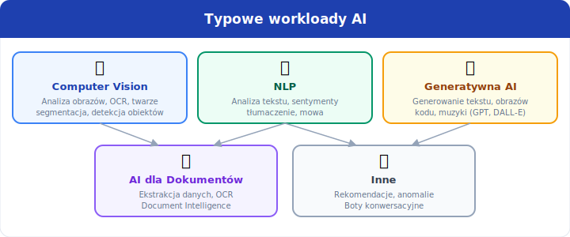
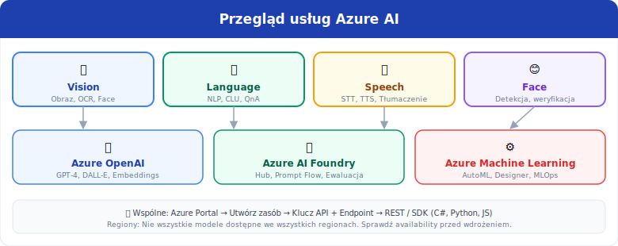

[⟵ Poprzedni: Wprowadzenie](01-wprowadzenie.md) | [Następny: Podstawy uczenia maszynowego ⟶](03-machine-learning.md)

# 2. Podstawy **AI** i rodzaje zadań

## Czym jest **AI**?
- **Sztuczna inteligencja (AI)** to dziedzina informatyki zajmująca się tworzeniem systemów, które potrafią wykonywać zadania wymagające inteligencji ludzkiej, takie jak rozumowanie, uczenie się, rozpoznawanie wzorców, podejmowanie decyzji czy rozumienie języka naturalnego.
- Przykłady zastosowań AI:
	- Rozpoznawanie obrazów (np. identyfikacja obiektów na zdjęciach)
	- Rozpoznawanie mowy i synteza mowy
	- Tłumaczenia maszynowe
	- Chatboty i wirtualni asystenci
	- Systemy rekomendacyjne (np. filmy, produkty)

## Typowe workloady **AI**
- **Computer Vision (CV)** – analiza i interpretacja obrazów/wideo przez komputer. Przykłady:
	- Klasyfikacja obrazów (co jest na zdjęciu?)
	- Detekcja obiektów (gdzie są obiekty?)
	- OCR (rozpoznawanie tekstu na obrazach)
	- Rozpoznawanie twarzy
- **Natural Language Processing (NLP)** – przetwarzanie i analiza języka naturalnego (tekst, mowa). Przykłady:
	- Analiza sentymentu (emocji w tekście)
	- Rozpoznawanie encji (np. osoby, miejsca)
	- Tłumaczenia maszynowe
	- Rozpoznawanie i synteza mowy
- **Generatywna AI** – tworzenie nowych treści przez modele AI. Przykłady:
	- Generowanie tekstu (podsumowania, chatboty)
	- Tworzenie obrazów, kodu, muzyki
	- Wyszukiwanie semantyczne
- **AI dla dokumentów** – automatyczna ekstrakcja danych, klasyfikacja dokumentów, digitalizacja (np. faktur, umów)

**Inne typowe workloady AI:**
- **Anomaly Detection** – wykrywanie nietypowych wzorców lub odchyleń od normy (np. wykrywanie oszustw, defektów produkcyjnych)
- **Recommendation Systems** – systemy rekomendacyjne (np. filmy, produkty, muzyka)
- **Speech Analytics** – analiza mowy, rozpoznawanie mówców, transkrypcje
- **Semantic Search** – wyszukiwanie informacji na podstawie znaczenia, a nie tylko słów kluczowych

## Anomaly Detection - szczegóły

- **Co to jest**: Algorytmy uczenia maszynowego / statystyczne szukające obserwacji istotnie różnych od większości danych (outliers, odchylenia od normy).
- **Typowe algorytmy**:
	- **Statistical methods** (Isolation Forest, Local Outlier Factor) – szybkie, dla danych tabelarycznych
	- **Neural networks** (autoencoders) – bardziej zaawansowane, dla danych złożonych (obrazy, sekwencje)
	- **One-class SVM** – dla problemów binarnych (normalne vs anomalne)
- **Typowe scenariusze biznesowe**:
	- Detekcja oszustw finansowych (transakcje o nietypowych kwotach, lokalizacjach, częstości)
	- Monitoring maszyn produkcyjnych (czujniki wskazujące anomalę = możliwa awaria)
	- Bezpieczeństwo sieci (anomalny ruch sieciowy = potencjalny atak)
	- Medycyna: wykrywanie pacjentów o atypowych wskaźnikach zdrowia
- **Azure**: Azure Machine Learning (AutoML obsługuje anomaly detection), Azure Stream Analytics (real-time anomalies), custom modele.

## Recommendation Systems - szczegóły

- **Co to jest**: Algorytmy przewidujące, jakie produkty/zawartość użytkownik może polubić, na podstawie historii, preferencji lub zachowania podobnych użytkowników.
- **Typowe algorytmy**:
	- **Collaborative Filtering** – „użytkownicy podobni do ciebie polubili..." (wymaga historii zachowań wielu użytkowników)
	- **Content-Based Filtering** – „produkty podobne do tych, które polubiłeś" (cechy produktu: gatunek, poziom ceny itp.)
	- **Hybrid** – kombinacja obu podejść (Microsoft, Netflix, Amazon)
	- **Matrix Factorization** – rozkład macierzy preferencji użytkowników (złożone, ale wydajne)
- **Typowe scenariusze biznesowe**:
	- E-commerce: „inni kupujący też kupili..." (Netflix, Amazon, Spotify)
	- Wyszukiwarki: spersonalizowane wyniki na podstawie profilu użytkownika
	- Media społecznościowe: feed personalizowany dla każdego użytkownika
	- Advertising: reklamy o wyższym CTR na podstawie preferencji
- **Azure**: Azure Machine Learning (budowanie modeli), Azure Personalization Service (historycznie: Recommendation API), Power Automate (integracja).

## Przykłady zastosowań
- **Rozpoznawanie twarzy** w systemach bezpieczeństwa
- **Analiza sentymentu** opinii klientów
- **OCR** do digitalizacji dokumentów papierowych
- **Chatboty** do automatyzacji obsługi klienta
- **Generowanie tekstu** marketingowego lub podsumowań
- **Automatyczne tłumaczenia** na różne języki
- **Wykrywanie defektów** na liniach produkcyjnych (wizja komputerowa)

**Dodatkowe przykłady:**
- **Systemy rekomendacyjne** – podpowiadanie produktów w sklepach internetowych
- **Wykrywanie oszustw** – analiza transakcji finansowych pod kątem fraudów
- **Transkrypcje spotkań** – automatyczne zapisywanie rozmów
- **Moderacja treści** – wykrywanie i usuwanie nieodpowiednich zdjęć lub tekstów

## Odpowiedzialna AI (**Responsible AI**)
- Kluczowe zasady:
	- **Fairness (sprawiedliwość)** – równe traktowanie wszystkich użytkowników, eliminacja biasu
	- **Inclusiveness (inkluzywność)** – projektowanie AI z myślą o dostępności dla różnych grup
	- **Bezpieczeństwo (Security)** – ochrona przed błędami, nadużyciami i atakami
	- **Prywatność (Privacy)** – ochrona danych osobowych, zgodność z RODO/GDPR
	- **Przejrzystość (Transparency)** – możliwość wyjaśnienia działania modelu, interpretowalność
	- **Odpowiedzialność (Accountability)** – jasne określenie, kto odpowiada za decyzje AI
	- **Niezawodność (Reliability)** – stabilność, odporność na błędy
	- **Compliance (zgodność z regulacjami)** – spełnianie wymogów prawnych
	- **Explainability (wyjaśnialność)** – możliwość zrozumienia, jak model podejmuje decyzje
	- **Monitoring** – śledzenie skuteczności i sprawiedliwości modeli po wdrożeniu
	- **Mitigating Bias** – aktywne wykrywanie i usuwanie tendencyjności
	- **Data Privacy Toolkit** – narzędzia do anonimizacji i ochrony danych

## Usługi **Azure AI**
- **Azure AI Vision** – analiza obrazów i wideo, klasyfikacja, detekcja obiektów, OCR, analiza cech wizualnych, moderacja treści
- **Azure AI Face** – detekcja, identyfikacja i weryfikacja tożsamości, analiza emocji, grupowanie twarzy
- **Azure AI Language** – analiza sentymentu, ekstrakcja kluczowych fraz, rozpoznawanie encji, tłumaczenia, klasyfikacja tekstu, wyszukiwanie semantyczne
- **Azure AI Speech** – rozpoznawanie mowy (STT – Speech-to-Text), synteza mowy (TTS – Text-to-Speech), rozpoznawanie mówców, tłumaczenia mowy w czasie rzeczywistym
- **Azure OpenAI** – generowanie tekstu, obrazów, kodu, podsumowań i tłumaczeń (modele GPT-4, DALL-E), wsparcie dla prompt engineering
- **Azure AI Foundry** – katalog modeli AI, zarządzanie cyklem życia modeli, integracja z innymi usługami
- **Azure Machine Learning** – trenowanie, wdrażanie i zarządzanie modelami ML, AutoML, pipeline'y, rejestr modeli, endpointy, monitoring, audyt

Każda z tych usług posiada gotowe API, które można łatwo zintegrować z aplikacjami biznesowymi, stronami internetowymi czy chatbotami. Usługi te są szeroko wykorzystywane w zadaniach takich jak: rozpoznawanie obrazów, analiza tekstu, automatyzacja obsługi klienta, generowanie treści, digitalizacja dokumentów czy monitorowanie bezpieczeństwa.

[⟵ Poprzedni: Wprowadzenie](01-wprowadzenie.md) | [Następny: Podstawy uczenia maszynowego ⟶](03-machine-learning.md)
