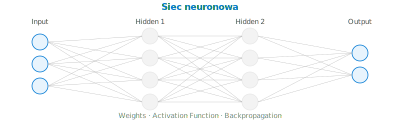

[⟵ Poprzedni: Podstawy AI i rodzaje zadań](02-ai-workloads.md) | [Następny: Computer Vision ⟶](04-computer-vision.md)

# 3. **Podstawy uczenia maszynowego (ML)**

## Czym jest **ML**?
- **Uczenie maszynowe (Machine Learning, ML)** to dziedzina AI, w której algorytmy uczą się na podstawie danych, aby przewidywać lub klasyfikować nowe przypadki bez jawnego programowania reguł.
- Przykłady zastosowań ML:
	- **Klasyfikacja**: wykrywanie spamu, rozpoznawanie obrazów
	- **Regresja**: prognozowanie cen, przewidywanie popytu
	- **Klasteryzacja**: segmentacja klientów, grupowanie dokumentów

## Typy uczenia
- **Supervised Learning (uczenie nadzorowane)** – model uczy się na danych z etykietami (np. zdjęcia podpisane jako „kot” lub „pies”). Przykład: klasyfikacja maili jako spam/nie-spam.

- **Unsupervised Learning (uczenie nienadzorowane)** – model sam szuka wzorców w nieoznaczonych danych (np. segmentacja klientów, klasteryzacja dokumentów).

- **Reinforcement Learning (uczenie ze wzmocnieniem)** – model uczy się przez nagrody i kary, np. grając w gry komputerowe lub sterując robotem.

## Sieci neuronowe (Neural Networks)
- **Sieć neuronowa** to model obliczeniowy inspirowany budową ludzkiego mózgu – składa się z warstw połączonych **neuronów** (węzłów), które przetwarzają dane wejściowe i uczą się rozpoznawać wzorce.
- Każdy neuron otrzymuje dane, mnoży je przez **wagi (weights)**, sumuje i przepuszcza przez **funkcję aktywacji** – wynik przekazuje dalej.
- Struktura sieci neuronowej:
	- **Warstwa wejściowa (Input Layer)** – przyjmuje dane (np. piksele obrazu, cechy liczbowe)
	- **Warstwy ukryte (Hidden Layers)** – przetwarzają dane, uczą się wzorców i zależności
	- **Warstwa wyjściowa (Output Layer)** – zwraca wynik (np. klasę, wartość liczbową)
- **Trening** sieci polega na podawaniu danych, porównywaniu wyników z oczekiwanymi i korygowaniu wag metodą **propagacji wstecznej (backpropagation)**.
- Im więcej warstw ukrytych, tym sieć potrafi uczyć się bardziej złożonych zależności – stąd termin **Deep Learning**.

## Deep Learning
- **Deep Learning** – uczenie maszynowe z wykorzystaniem wielowarstwowych sieci neuronowych, szczególnie skuteczne w analizie obrazów i języka.

## Transformers
- **Transformers** – nowoczesna architektura sieci neuronowych oparta na mechanizmie **uwagi (attention)**, który pozwala modelowi skupiać się na najważniejszych fragmentach danych wejściowych. Wykorzystywana m.in. w modelach językowych (np. **GPT**, **BERT**).

## Kluczowe zadania ML
- **Regresja (Regression)** – przewidywanie wartości liczbowych (np. prognoza cen mieszkań, przewidywanie temperatury).
- **Klasyfikacja (Classification)** – przypisywanie do kategorii (np. wykrywanie spamu, rozpoznawanie gatunków zwierząt na zdjęciach).
- **Klasteryzacja (Clustering)** – grupowanie podobnych danych (np. segmentacja klientów sklepu, grupowanie artykułów prasowych).

## Overfitting i underfitting
- **Overfitting (przeuczenie)** – model zbyt dobrze dopasowany do danych treningowych, słabo generalizuje do nowych danych. Przykład: model zapamiętuje dane zamiast uczyć się ogólnych wzorców.
- **Underfitting (niedouczenie)** – model zbyt prosty, nie uczy się zależności w danych, osiąga niską skuteczność zarówno na danych treningowych, jak i testowych.

## Metryki oceny modeli

- **Accuracy (dokładność)** – odsetek poprawnych przewidywań.
- **Precision (precyzja)** – odsetek trafień wśród przewidzianych pozytywnych.
- **Recall (czułość)** – odsetek wykrytych pozytywnych spośród wszystkich rzeczywistych.
- **F1-score** – średnia harmoniczna precision i recall.
- **Mean Square Error (MSE)** – średnia arytmetyczna kwadratów różnic między wartościami rzeczywistymi a przewidywanymi przez model. Im niższa wartość MSE, tym lepsze dopasowanie modelu regresyjnego.
- **Confusion Matrix (macierz pomyłek)** – tabela pokazująca liczbę poprawnych i błędnych klasyfikacji.
		- Przykład macierzy pomyłek:

	|                | Przewidziane: Pozytywne | Przewidziane: Negatywne |
	|----------------|------------------------|------------------------|
	| Rzeczywiste: Pozytywne | True Positive (TP)         | False Negative (FN)         |
	| Rzeczywiste: Negatywne | False Positive (FP)        | True Negative (TN)          |

	- **True Positive (TP)** – przypadki poprawnie zaklasyfikowane jako pozytywne
	- **False Positive (FP)** – przypadki błędnie zaklasyfikowane jako pozytywne (fałszywy alarm)
	- **True Negative (TN)** – przypadki poprawnie zaklasyfikowane jako negatywne
	- **False Negative (FN)** – przypadki błędnie zaklasyfikowane jako negatywne (przeoczenie)
- **ROC Curve, AUC** – krzywa ROC i pole pod krzywą, metryki oceny skuteczności klasyfikatorów.

## Proces ML

1. **Zbieranie danych** – pozyskiwanie i przygotowanie danych do analizy.
2. **Podział danych** – na zbiory: treningowy, walidacyjny, testowy.
3. **Feature engineering** – wybór i przetwarzanie cech (features).
4. **Trening modelu** – uczenie modelu na danych treningowych.
5. **Walidacja** – ocena modelu na zbiorze walidacyjnym, tuning parametrów.
6. **Testowanie** – sprawdzenie skuteczności na nowych danych (zbiór testowy).
7. **Deployment** – wdrożenie modelu do produkcji (np. jako API).
8. **Monitorowanie** – śledzenie działania modelu i jego skuteczności w czasie.

**Dodatkowe pojęcia i praktyki:**
- **Drift** – zmiana rozkładu danych w czasie, która może pogorszyć skuteczność modelu
- **Data Imbalance** – nierównomierny rozkład klas w zbiorze danych
- **Transfer Learning** – wykorzystanie modelu wytrenowanego na innym zadaniu
- **Data Augmentation** – sztuczne zwiększanie liczby przykładów przez modyfikacje danych
- **Retraining** – ponowne trenowanie modelu na nowych danych
- **Monitoring** – śledzenie skuteczności i sprawiedliwości modeli po wdrożeniu
- **Interpretability** – możliwość zrozumienia, jak model podejmuje decyzje
- **Compliance** – zgodność z regulacjami prawnymi (np. RODO)
- **Fairness** – sprawiedliwość, równe traktowanie grup
- **Explainability** – wyjaśnialność decyzji modelu
- **Pipeline** – sekwencja kroków przetwarzania danych i trenowania modelu
- **Endpoint** – punkt dostępu do modelu przez API

## Cykl życia ML

## Usługi **Azure ML**
- **Azure Machine Learning** – platforma do trenowania, wdrażania i zarządzania modelami ML w chmurze Azure. Umożliwia:
	- Tworzenie eksperymentów ML (notebooki, pipeline’y)
	- Automatyzację procesu ML (AutoML)
	- Zarządzanie danymi i zasobami obliczeniowymi (Data/Compute)
	- Rejestrację i wersjonowanie modeli (**Model Registry**)
	- Wdrażanie modeli jako **endpointy** (API)
	- Monitorowanie i audyt modeli
- **Automated ML (AutoML)** – automatyczne trenowanie i wybór najlepszego modelu na podstawie danych:
	1. **Wskazujesz dane** – przesyłasz zbiór danych (CSV, Azure Blob, SQL)
	2. **Wybierasz typ zadania** – klasyfikacja, regresja lub prognozowanie szeregów czasowych
	3. **Wybierasz kolumnę docelową** (target column) – co model ma przewidywać
	4. **AutoML automatycznie**:
		- Testuje wiele algorytmów (np. LogisticRegression, XGBoost, LightGBM, RandomForest)
		- Przeprowadza **feature engineering** (normalizacja, kodowanie, imputacja braków)
		- Stosuje **cross-validation** (walidację krzyżową) do oceny modeli
		- Optymalizuje hiperparametry każdego algorytmu
	5. **Ranking modeli** – AutoML porównuje wyniki według wybranej metryki (Accuracy, AUC, RMSE itp.) i wskazuje **najlepszy model**
	6. **Wdrożenie** – najlepszy model można jednym kliknięciem wdrożyć jako **REST API endpoint**
- **Data/Compute** – zarządzanie danymi i mocą obliczeniową w chmurze.
- **Model Registry** – repozytorium do przechowywania i wersjonowania **własnych** wytrenowanych modeli ML (każdy model ma wersję, metadane, metryki)
- **Model Catalog (Azure AI Foundry)** – katalog gotowych, **pre-built** modeli do użycia od razu lub fine-tuningu:
	- **Modele OpenAI**: GPT-4, GPT-4o, GPT-4o-mini, GPT-3.5-Turbo, DALL-E 3, Whisper, text-embedding-ada-002
	- **Modele Meta**: Llama 3, Llama 2
	- **Modele Mistral**: Mistral Large, Mistral Small
	- **Modele Microsoft**: Phi-3, Phi-2 (małe, wydajne modele językowe)
	- **Modele Hugging Face**: tysiące modeli open-source (NLP, Vision, Audio)
	- **Modele Cohere**: Command, Embed (generowanie, embeddingi)

[⟵ Poprzedni: Podstawy AI i rodzaje zadań](02-ai-workloads.md) | [Następny: Computer Vision ⟶](04-computer-vision.md)
