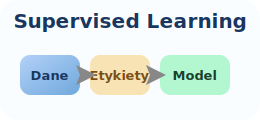
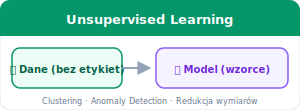
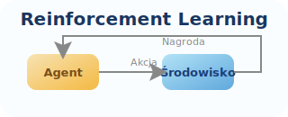
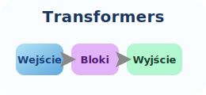
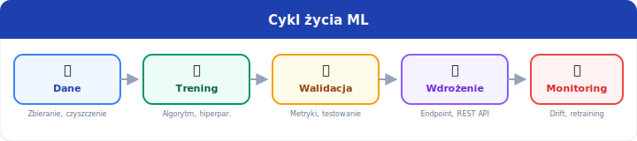

[⟵ Poprzedni: Podstawy AI i rodzaje zadań](02-ai-workloads.md) | [Następny: Computer Vision ⟶](04-computer-vision.md)

# 3. **Podstawy uczenia maszynowego (ML)**

## Czym jest **ML**?
- **Uczenie maszynowe (Machine Learning, ML)** to dziedzina AI, w której algorytmy uczą się na podstawie danych, aby przewidywać lub klasyfikować nowe przypadki bez jawnego programowania reguł.
- Przykłady zastosowań ML:
	- **Klasyfikacja**: wykrywanie spamu, rozpoznawanie obrazów
	- **Regresja**: prognozowanie cen, przewidywanie popytu
	- **Klasteryzacja**: segmentacja klientów, grupowanie dokumentów

## Typy uczenia
- **Supervised Learning (uczenie nadzorowane)** – model uczy się na danych z etykietami (np. zdjęcia podpisane jako „kot” lub „pies”). Przykład: klasyfikacja maili jako spam/nie-spam.

- **Unsupervised Learning (uczenie nienadzorowane)** – model sam szuka wzorców w nieoznaczonych danych (np. segmentacja klientów, klasteryzacja dokumentów).

- **Reinforcement Learning (uczenie ze wzmocnieniem)** – model uczy się przez nagrody i kary, np. grając w gry komputerowe lub sterując robotem.

- **Deep Learning** – uczenie maszynowe z wykorzystaniem wielowarstwowych sieci neuronowych, szczególnie skuteczne w analizie obrazów i języka.

- **Transformers** – nowoczesna architektura sieci neuronowych, wykorzystywana m.in. w modelach językowych (np. **GPT**, **BERT**).

## Kluczowe zadania ML
- **Regresja (Regression)** – przewidywanie wartości liczbowych (np. prognoza cen mieszkań, przewidywanie temperatury).
- **Klasyfikacja (Classification)** – przypisywanie do kategorii (np. wykrywanie spamu, rozpoznawanie gatunków zwierząt na zdjęciach).
- **Klasteryzacja (Clustering)** – grupowanie podobnych danych (np. segmentacja klientów sklepu, grupowanie artykułów prasowych).

## Overfitting i underfitting
- **Overfitting (przeuczenie)** – model zbyt dobrze dopasowany do danych treningowych, słabo generalizuje do nowych danych. Przykład: model zapamiętuje dane zamiast uczyć się ogólnych wzorców.
- **Underfitting (niedouczenie)** – model zbyt prosty, nie uczy się zależności w danych, osiąga niską skuteczność zarówno na danych treningowych, jak i testowych.

## Metryki oceny modeli
- **Accuracy (dokładność)** – odsetek poprawnych przewidywań.
- **Precision (precyzja)** – odsetek trafień wśród przewidzianych pozytywnych.
- **Recall (czułość)** – odsetek wykrytych pozytywnych spośród wszystkich rzeczywistych.
- **F1-score** – średnia harmoniczna precision i recall.
- **Confusion Matrix (macierz pomyłek)** – tabela pokazująca liczbę poprawnych i błędnych klasyfikacji.
- **ROC Curve, AUC** – krzywa ROC i pole pod krzywą, metryki oceny skuteczności klasyfikatorów.

## Proces ML
1. **Zbieranie danych** – pozyskiwanie i przygotowanie danych do analizy.
2. **Podział danych** – na zbiory: treningowy, walidacyjny, testowy.
3. **Feature engineering** – wybór i przetwarzanie cech (features).
4. **Trening modelu** – uczenie modelu na danych treningowych.
5. **Walidacja** – ocena modelu na zbiorze walidacyjnym, tuning parametrów.
6. **Testowanie** – sprawdzenie skuteczności na nowych danych (zbiór testowy).
7. **Deployment** – wdrożenie modelu do produkcji (np. jako API).
8. **Monitorowanie** – śledzenie działania modelu i jego skuteczności w czasie.

## Cykl życia ML

## Usługi **Azure ML**
- **Azure Machine Learning** – platforma do trenowania, wdrażania i zarządzania modelami ML w chmurze Azure. Umożliwia:
	- Tworzenie eksperymentów ML (notebooki, pipeline’y)
	- Automatyzację procesu ML (AutoML)
	- Zarządzanie danymi i zasobami obliczeniowymi (Data/Compute)
	- Rejestrację i wersjonowanie modeli (**Model Registry**)
	- Wdrażanie modeli jako **endpointy** (API)
	- Monitorowanie i audyt modeli
- **Automated ML** – automatyczne trenowanie i wybór najlepszego modelu na podstawie danych.
- **Data/Compute** – zarządzanie danymi i mocą obliczeniową w chmurze.
- **Model Registry** – repozytorium do przechowywania i wersjonowania modeli ML.

[⟵ Poprzedni: Podstawy AI i rodzaje zadań](02-ai-workloads.md) | [Następny: Computer Vision ⟶](04-computer-vision.md)
