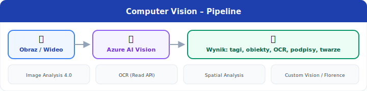

[⟵ Poprzedni: Podstawy uczenia maszynowego](03-machine-learning.md) | [Następny: Natural Language Processing ⟶](05-nlp.md)

# 4. **Computer Vision** na **Azure**

## Czym jest **Computer Vision**?
- **Computer Vision** to dziedzina AI zajmująca się analizą i interpretacją obrazów oraz wideo przez komputer. Pozwala na automatyczne rozpoznawanie, klasyfikowanie i interpretowanie zawartości wizualnej, co znajduje zastosowanie w wielu branżach.

## Typowe zadania
- **Przykładowy przepływ Computer Vision:**

- **Klasyfikacja obrazów (Image Classification)** – przypisywanie etykiet do całych obrazów (np. rozpoznawanie gatunku zwierzęcia na zdjęciu).
- **Detekcja obiektów (Object Detection)** – lokalizowanie i klasyfikowanie wielu obiektów na jednym obrazie (np. wykrywanie samochodów na drodze).
- **OCR (Optical Character Recognition)** – rozpoznawanie tekstu na obrazach, digitalizacja dokumentów papierowych (np. faktury, paragony, umowy).
- **Rozpoznawanie twarzy (Face Recognition)** – identyfikacja osób, analiza emocji, weryfikacja tożsamości.
- **Detekcja anomalii (Anomaly Detection)** – wykrywanie nietypowych wzorców lub defektów na obrazach (np. kontrola jakości w produkcji, wykrywanie uszkodzeń na liniach montażowych).

## Usługi **Azure**
- **Azure AI Vision** – kompleksowa usługa do analizy obrazów i wideo. Umożliwia:

- **Azure AI Vision** – kompleksowa usługa do analizy obrazów i wideo. Umożliwia:
- **Azure AI Vision** – kompleksowa usługa do analizy obrazów i wideo. Umożliwia:
	- Klasyfikację obrazów (Image Classification)
	- Detekcję obiektów (Object Detection)
	- OCR (rozpoznawanie tekstu na obrazach)
	- Analizę cech wizualnych (np. kolory, kształty, tagi)
	- Moderację treści (wykrywanie treści nieodpowiednich)
- **Azure AI Face** – specjalistyczna usługa do rozpoznawania i analizy twarzy. Pozwala na:

	- Detekcję i identyfikację twarzy na zdjęciach i wideo
	- Analizę emocji, wieku, płci
	- Weryfikację tożsamości (np. logowanie biometryczne)
	- Grupowanie i porównywanie twarzy

## Przykłady zastosowań
- **Automatyczna moderacja zdjęć** w mediach społecznościowych (usuwanie treści nieodpowiednich)
- **Weryfikacja tożsamości** w bankowości i systemach bezpieczeństwa (biometria twarzy)
- **Digitalizacja dokumentów** – automatyczne odczytywanie danych z faktur, paragonów, umów (OCR)
- **Wykrywanie defektów** na liniach produkcyjnych (detekcja anomalii, kontrola jakości)
- **Systemy monitoringu** – wykrywanie podejrzanych zachowań lub obiektów
- **Aplikacje dla osób niewidomych** – opisywanie otoczenia na podstawie obrazu z kamery

[⟵ Poprzedni: Podstawy uczenia maszynowego](03-machine-learning.md) | [Następny: Natural Language Processing ⟶](05-nlp.md)
