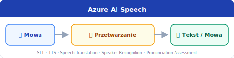

[⟵ Poprzedni: Computer Vision](04-computer-vision.md) | [Następny: Generatywna AI ⟶](06-generative-ai.md)

# 5. **Natural Language Processing (NLP)**

## Czym jest **NLP**?
- **Natural Language Processing (NLP)** to dziedzina AI zajmująca się przetwarzaniem, analizą i rozumieniem języka naturalnego przez komputery. Obejmuje zarówno tekst pisany, jak i mowę. NLP pozwala maszynom rozumieć, generować, tłumaczyć i analizować język ludzki.

## Typowe zadania

- **Ekstrakcja fraz kluczowych (Key Phrase Extraction)** – wyodrębnianie najważniejszych słów i zwrotów z tekstu.
- **Rozpoznawanie encji (Entity Recognition)** – identyfikacja nazw własnych, takich jak osoby, miejsca, organizacje.
- **Analiza sentymentu (Sentiment Analysis)** – określanie emocji w tekście (np. pozytywny/negatywny komentarz).
- **Modelowanie języka (Language Modeling)** – przewidywanie kolejnych słów w zdaniu, generowanie tekstu.
- **Rozpoznawanie i synteza mowy (Speech Recognition & Synthesis)** – zamiana mowy na tekst i odwrotnie.
- **Tłumaczenia (Translation)** – automatyczne tłumaczenie tekstu na inne języki.
- **Tokenizacja (Tokenization)** – dzielenie tekstu na słowa, zdania lub inne jednostki.
- **Lematyzacja (Lemmatization)** – sprowadzanie słów do formy podstawowej (np. „pies” zamiast „psa”, „psom”).
- **Embeddingi (Embeddings)** – zamiana tekstu na wektory liczbowe, które mogą być analizowane przez modele ML.
- **Rozpoznawanie intencji (Intent Recognition)** – określanie celu wypowiedzi użytkownika (np. pytanie o pogodę, zamówienie pizzy).

## Usługi **Azure**
- **Azure AI Language** – kompleksowa usługa do analizy tekstu. Umożliwia:

- **Azure AI Language** – kompleksowa usługa do analizy tekstu. Umożliwia:
- **Azure AI Language** – kompleksowa usługa do analizy tekstu. Umożliwia:
	- Analizę sentymentu
	- Ekstrakcję fraz kluczowych
	- Rozpoznawanie encji
	- Tłumaczenia maszynowe
	- Klasyfikację tekstu
	- Wyszukiwanie semantyczne
- **Azure AI Speech** – usługa do rozpoznawania i syntezy mowy. Pozwala na:

	- Zamianę mowy na tekst (Speech-to-Text)
	- Zamianę tekstu na mowę (Text-to-Speech)
	- Rozpoznawanie mówców (Speaker Recognition)
	- Tłumaczenia mowy w czasie rzeczywistym

## Przykłady zastosowań
- **Chatboty** – automatyzacja obsługi klienta, odpowiadanie na pytania użytkowników
- **Analiza opinii klientów** – monitorowanie nastrojów w recenzjach i mediach społecznościowych
- **Automatyczne tłumaczenia** – szybkie tłumaczenie dokumentów i komunikacji
- **Wyszukiwanie semantyczne (Semantic Search)** – inteligentne wyszukiwanie informacji w dużych zbiorach tekstu
- **Asystenci głosowi** – sterowanie urządzeniami za pomocą mowy
- **Transkrypcje spotkań** – automatyczne zapisywanie rozmów i spotkań

[⟵ Poprzedni: Computer Vision](04-computer-vision.md) | [Następny: Generatywna AI ⟶](06-generative-ai.md)
