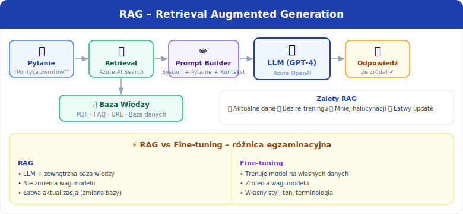

[⟵ Poprzedni: Natural Language Processing](05-nlp.md) | [Następny: Responsible AI ⟶](07-responsible-ai.md)

# 6. **Generatywna AI (Generative AI)** na **Azure**

## Czym jest **generatywna AI**?
- **Generatywna AI (Generative AI)** to dziedzina sztucznej inteligencji, która koncentruje się na tworzeniu nowych treści przez modele AI. Modele te potrafią generować tekst, obrazy, kod, muzykę, a nawet wideo na podstawie dostarczonych poleceń (promptów) lub danych wejściowych. Generatywna AI znajduje zastosowanie w automatyzacji, kreatywnych projektach, wsparciu programistów i wielu innych obszarach.

## Typowe zadania

- **Generowanie tekstu (Text Generation)** – tworzenie podsumowań, odpowiedzi w chatbotach, generowanie artykułów, e-maili, opisów produktów.
- **Tworzenie obrazów, kodu, muzyki (Image, Code, Music Generation)** – generowanie grafik na podstawie opisu, automatyczne pisanie kodu, komponowanie muzyki.
- **Wyszukiwanie semantyczne (Semantic Search)** – inteligentne wyszukiwanie informacji na podstawie znaczenia, a nie tylko słów kluczowych.
- **Podsumowywanie dokumentów** – automatyczne streszczanie długich tekstów.
- **Tłumaczenia maszynowe** – generowanie tłumaczeń na podstawie kontekstu.

## Modele
- **GPT (OpenAI)** – generowanie tekstu, chatboty, podsumowania.
- **DALL-E** – generowanie obrazów na podstawie opisu tekstowego.
- **Stable Diffusion** – generowanie obrazów, grafiki artystycznej.
- **Transformers** – architektura wykorzystywana w nowoczesnych modelach generatywnych.
- **Embeddings** – reprezentacja tekstu/obrazów w postaci wektorów liczbowych, wykorzystywana do wyszukiwania semantycznego i porównywania treści.

## Prompt engineering
- **Prompt engineering** – sztuka tworzenia skutecznych poleceń (promptów) dla modeli generatywnych, aby uzyskać pożądane wyniki. Odpowiednio sformułowany prompt pozwala uzyskać bardziej precyzyjne, kreatywne lub zgodne z oczekiwaniami odpowiedzi. Przykład: "Napisz podsumowanie tego artykułu w 3 zdaniach".

## Ograniczenia generatywnej AI
- **Halucynacje (Hallucinations)** – model może generować nieprawdziwe lub zmyślone informacje.
- **Bias** – tendencyjność wyników, model może powielać uprzedzenia obecne w danych treningowych.
- **Ograniczona kontrola** – trudność w uzyskaniu bardzo precyzyjnych lub zgodnych z oczekiwaniami wyników.
- **Brak świadomości** – model nie rozumie świata, tylko przewiduje kolejne słowa/elementy na podstawie danych.
- **Prompt Injection** – atak polegający na przemyceniu złośliwych instrukcji w danych wejściowych, by zmanipulować zachowanie modelu.

## Kluczowe pojęcia – egzamin AI-900

- **RAG (Retrieval Augmented Generation)** – technika łącząca model LLM z zewnętrznymi źródłami wiedzy (bazy danych, dokumenty, wyszukiwarki). Model pobiera aktualny kontekst i na jego podstawie generuje odpowiedź. Redukuje halucynacje i pozwala odpowiadać na pytania o aktualne dane.
- **Grounding (zakotwiczenie)** – powiązanie odpowiedzi modelu z konkretnymi, zweryfikowanymi danymi lub dokumentami. Zwiększa dokładność i wiarygodność wyników.
- **System Message (komunikat systemowy)** – instrukcja przekazywana modelowi na początku sesji, definiująca jego rolę, ton i ograniczenia (np. „Jesteś pomocnym asystentem obsługi klienta firmy X. Nie omawiasz tematów niezwiązanych z produktem").
- **Roles w API (role)** – wiadomości w API mają trzy typy: **system** (instrukcja), **user** (pytanie użytkownika), **assistant** (poprzednia odpowiedź modelu). Pozwala to budować wieloturowe rozmowy.
- **Temperature (temperatura)** – parametr losowości odpowiedzi: `0` = deterministyczny, powtarzalny; `1+` = kreatywny, zróżnicowany. Niska temperatura – fakty i kod; wysoka – kreatywne treści.
- **Top-p (nucleus sampling)** – alternatywna metoda kontroli losowości, ogranicza zbiór branych pod uwagę tokenów do najbardziej prawdopodobnych.
- **Token** – podstawowa jednostka tekstu dla modeli LLM (ok. ¾ słowa po angielsku). Cena za korzystanie z API jest rozliczana za tokeny (input + output).
- **Context Window (okno kontekstowe)** – maksymalna liczba tokenów przetwarzana jednorazowo przez model (historia rozmowy + pytanie + odpowiedź). Przekroczenie limitu = ucięcie kontekstu.
- **Fine-tuning** – dodatkowe trenowanie pre-trenowanego modelu na własnym zbiorze danych, by dostosować go do konkretnego zadania lub stylu.
- **Content Filters (filtry treści)** – mechanizmy Azure OpenAI automatycznie blokujące lub flagujące treści szkodliwe: mowę nienawiści, przemoc, treści seksualne, autodestrukcyjne. Konfigurowane na poziomie deployment.
- **Responsible AI w generatywnej AI** – stosowanie content filters, grounding, monitorowanie, transparentność źródeł, ochrona prywatności i danych użytkowników.

## Usługi **Azure**
- **Azure OpenAI** – dostęp do zaawansowanych modeli generatywnych (GPT-4, GPT-3.5, DALL-E, embeddings) przez API. Wymaga akceptacji przez Microsoft. Obsługuje chat completions, image generation, embeddings, RAG.
- **Azure AI Foundry** – katalog modeli AI (w tym open source: Llama, Mistral, Phi), Prompt Flow do budowy pipeline'ów AI, zarządzanie modelami i wdrożeniami.
- **Azure Machine Learning** – możliwość fine-tuningu i wdrażania własnych modeli generatywnych.
- **Azure AI Content Safety** – filtrowanie i moderowanie treści generowanych przez AI: mowa nienawiści, przemoc, treści seksualne, samookaleczenie. Konfigurowalne poziomy czułości.

## Przykłady zastosowań
- **Automatyzacja obsługi klienta** – chatboty, automatyczne odpowiedzi na e-maile
- **Tworzenie treści marketingowych** – generowanie opisów produktów, postów na media społecznościowe
- **Wsparcie programistów (AI pair programming)** – podpowiedzi kodu, generowanie fragmentów kodu
- **Tworzenie grafik i ilustracji** – generowanie obrazów na podstawie opisu
- **Podsumowywanie dokumentów** – automatyczne streszczanie raportów, artykułów
- **Tłumaczenia maszynowe** – szybkie tłumaczenie tekstów na różne języki

[⟵ Poprzedni: Natural Language Processing](05-nlp.md) | [Następny: Responsible AI ⟶](07-responsible-ai.md)
