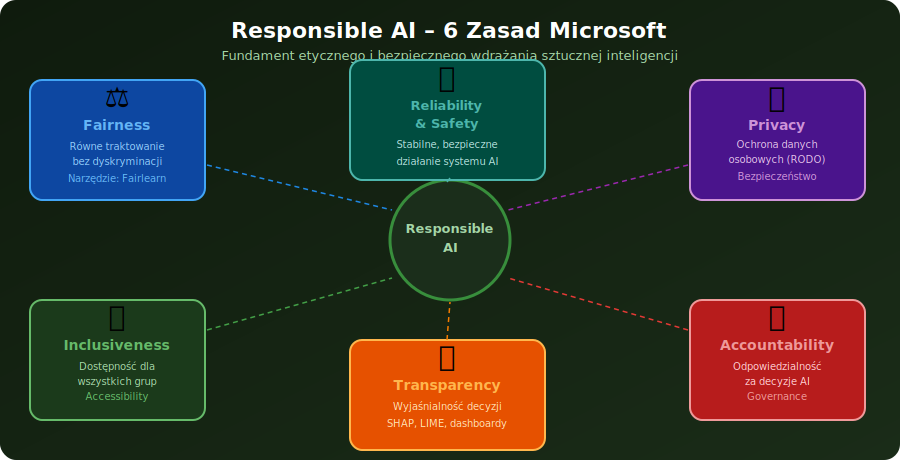

[⟵ Poprzedni: Generatywna AI](06-generative-ai.md) | [Następny: Szybka ściąga i pułapki ⟶](08-last-minute-cram.md)

# 7. **Responsible AI (Odpowiedzialna AI)** – zasady i etyka

## Czym jest **Responsible AI**?
- **Responsible AI** to zbiór zasad, praktyk i narzędzi, które mają zapewnić, że systemy sztucznej inteligencji są tworzone i wdrażane w sposób etyczny, bezpieczny, przejrzysty i sprawiedliwy. Odpowiedzialna AI minimalizuje ryzyko błędów, uprzedzeń i negatywnego wpływu na użytkowników oraz społeczeństwo.

## Kluczowe zasady Responsible AI

- **Fairness (sprawiedliwość)** – równe traktowanie wszystkich użytkowników, eliminacja dyskryminacji i biasu.
- **Reliability & Safety (niezawodność, bezpieczeństwo)** – systemy AI muszą działać zgodnie z założeniami i być odporne na błędy oraz ataki.
- **Privacy & Security (prywatność, ochrona danych)** – ochrona danych osobowych i zapewnienie bezpieczeństwa informacji.
- **Inclusiveness (inkluzywność)** – projektowanie AI z myślą o dostępności dla różnych grup użytkowników.
- **Transparency (przejrzystość)** – możliwość wyjaśnienia, jak AI podejmuje decyzje, jasność działania algorytmów.
- **Accountability (odpowiedzialność)** – jasne określenie, kto odpowiada za decyzje i skutki działania AI.

## Przykłady zastosowań Responsible AI
- Eliminacja **biasu (Bias)** w danych – np. usuwanie tendencyjnych przykładów z danych treningowych.
- **Wyjaśnialność (Explainability)** decyzji AI – stosowanie narzędzi wyjaśniających, dlaczego model podjął daną decyzję (np. SHAP, LIME).
- **Ochrona prywatności użytkowników** – anonimizacja danych, stosowanie polityk prywatności.
- **Compliance** – zgodność z regulacjami prawnymi (np. RODO, GDPR, HIPAA).
- **Monitorowanie modeli** – śledzenie skuteczności i sprawiedliwości modeli po wdrożeniu.

## Narzędzia i usługi **Azure** wspierające Responsible AI
- **Azure Machine Learning Responsible AI dashboard** – panel do monitorowania, audytu, wykrywania biasu, wyjaśniania decyzji modeli (Error Analysis, Fairness, Explainability, Causal Analysis).
- **Fairlearn** – open-source’owe narzędzie do oceny i poprawy sprawiedliwości modeli ML.
- **InterpretML** – narzędzie do wyjaśniania decyzji modeli (SHAP, LIME) – explainability.
- **Azure AI Content Safety** – wykrywanie i blokowanie szkodliwych treści generowanych lub podawanych przez AI: mowa nienawiści, przemoc, treści seksualne, samookaleczenie. Dostępna jako osobna usługa API.

- **Monitorowanie modeli** – automatyczne śledzenie skuteczności, driftu danych i potencjalnych problemów etycznych.
- **Compliance Manager** – wsparcie dla zgodności z regulacjami prawnymi (ISO, GDPR, HIPAA, SOC).
- **Data Privacy Toolkit** – narzędzia do anonimizacji i ochrony danych.
- **Azure Policy i RBAC** – kontrola dostępu i egzekwowanie polityk zgodności w usługach AI.

[⟵ Poprzedni: Generatywna AI](06-generative-ai.md) | [Następny: Szybka ściąga i pułapki ⟶](08-last-minute-cram.md)
