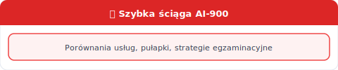

[⟵ Poprzedni: Responsible AI](07-responsible-ai.md) | [Następny: Glosariusz ⟶](09-glosariusz.md)

# 8. **Szybka ściąga i pułapki egzaminacyjne AI-900**

## Najważniejsze różnice i pułapki
- **Computer Vision** ≠ **NLP** ≠ **Generatywna AI** – rozpoznawaj typ workloadu po opisie zadania (np. "analiza obrazu" to Computer Vision, "analiza tekstu" to NLP).
- **OCR** = rozpoznawanie tekstu na obrazach, nie analiza sentymentu (OCR to Computer Vision, nie NLP).
- **Sentiment analysis** = **NLP**, nie **Computer Vision** (emocje w tekście, nie na obrazach).
- **GPT** = **generatywna AI**, nie klasyczne **ML** (GPT generuje tekst, nie klasyfikuje danych).
- **Responsible AI** = etyka, bezpieczeństwo, przejrzystość – zawsze wybieraj odpowiedzi promujące te wartości.
- **Klasyfikacja** to przypisywanie do kategorii, **regresja** to przewidywanie liczby.
- **Klasteryzacja** nie wymaga etykiet – to uczenie nienadzorowane.
- **Overfitting** – model działa świetnie na danych treningowych, słabo na nowych.
- **Precision** i **recall** – nie myl tych metryk!

## Szybkie porównania usług Azure AI
| Zadanie | Usługa **Azure** | Opis |
|---------|--------------|------|
| Klasyfikacja obrazów | **AI Vision / Custom Vision** | Rozpoznawanie, tagowanie, analiza obrazów; Custom Vision – własne modele |
| Detekcja twarzy | **AI Face** | Identyfikacja, analiza emocji, weryfikacja tożsamości |
| Analiza tekstu | **AI Language** | Sentyment, frazy kluczowe, NER, PII, podsumowanie |
| Rozpoznawanie intencji w chatbocie | **AI Language (CLU)** | Conversational Language Understanding – następca LUIS |
| Baza Q&A | **AI Language (Question Answering)** | Odpowiedzi na pytania z dokumentów i FAQ |
| Rozpoznawanie mowy | **AI Speech** | Zamiana mowy na tekst i odwrotnie |
| Synteza mowy | **AI Speech (TTS)** | Text-to-Speech, Custom Voice |
| Generowanie tekstu/kodu | **Azure OpenAI** | GPT-4, GPT-3.5 – tworzenie treści, kodu, podsumowań |
| Generowanie obrazów | **Azure OpenAI (DALL-E)** | Text-to-image |
| Ekstrakcja danych z dokumentów | **AI Document Intelligence** | Faktury, paragony, formularze, dowody tożsamości |
| Moderacja treści AI | **AI Content Safety** | Blokowanie szkodliwych treści, mowy nienawiści |
| Katalog modeli AI | **AI Foundry** | Zarządzanie i wdrażanie modeli, Prompt Flow |
| Trenowanie własnych modeli | **Azure Machine Learning** | AutoML, Designer, pipeline’y, MLOps |

## RAG vs Fine-tuning – kluczowa różnica
| Aspekt | **RAG** | **Fine-tuning** |
|--------|--------|----------------|
| Cel | Zasilanie modelu aktualną wiedzą z zewnętrznych źródeł | Dostosowanie zachowania i stylu modelu |
| Dane treningowe | Nie zmienia wag modelu | Zmienia wagi modelu |
| Koszt | Niższy (tylko zapytania) | Wyższy (trening) |
| Aktualizacja wiedzy | Łatwa (zmiana bazy) | Trudna (ponowny trening) |
| Zastosowanie | Aktualne dane firmowe, FAQ, dokumenty | Specyficzny styl, ton, terminologia |

## Azure AI Services - szybkie fakty na egzamin
- **Azure AI Services** to gotowe modele AI jako API - szybkie wdrozenie bez trenowania od zera.
- **Single-service resource** = jeden zasob dla jednej uslugi; **Multi-service resource** = jeden zasob dla wielu uslug.
- **Azure OpenAI** to oddzielny zasob i oddzielny proces dostepu (wymagana akceptacja Microsoft).
- Gdy scenariusz mowi o szybkim wdrozeniu gotowych funkcji (OCR, NER, STT, TTS), zwykle wybierasz **Azure AI Services**.
- Gdy scenariusz wymaga pelnej kontroli treningu, eksperymentow i MLOps, zwykle wybierasz **Azure Machine Learning**.
- W pytaniach produkcyjnych zwracaj uwage na: **endpoint**, **autoryzacje** (klucz/Entra ID), **region**, **limity** i **koszty**.
- W GenAI zawsze uwzgledniaj **Content Filters**, **grounding/RAG** oraz zasady **Responsible AI**.

## Agenci AI – nowy temat (AI-900/AI-901)
- **Agent** = LLM + Instructions + Tools, działający autonomicznie (nie tylko chatbot)
- **Typy**: Prompt Agents (no-code), Workflow Agents (YAML, multi-step), Hosted Agents (kod, full control)
- **Tools**: web search, file search, memory, code interpreter, API calls, Azure DevOps (MCP)
- **Lifecycle**: Create → Test → Trace → Evaluate → Publish → Monitor
- **RAG dla agentów**: Foundry IQ + Azure AI Search (vector store dla knowledge base)
- **Bezpieczeństwo**: Content Filters, prompt injection defense, XPIA protection (cross-prompt injection)
- **Evaluation**: coherence, fluency, relevance – metryki do oceny agenta
- **Monitoring**: tracing każdego kroku, agent dashboard

## Vector Search & Hybrid Search
- **Vector Search**: similarity na bazie embedding'ów (semantyka, wielojęzyczność, multimodal)
- **Hybrid Search**: vector + keyword razem = lepsze wyniki
- **Azure AI Search**: wektorowa baza danych, integracja RAG, Foundry Agents
- **Scenario**: Pytanie → embedding → vector query → top-K docs → LLM generuje odpowiedź

## Strategie egzaminacyjne
- Czytaj uważnie scenariusz – kluczowe są słowa: „**klasyfikacja**”, „**generowanie**”, „**ekstrakcja**”, „**tłumaczenie**”, „**rozpoznawanie**”.
- Eliminuj odpowiedzi niepassujące do typu workloadu (np. nie wybieraj usługi tekstowej do zadania z obrazem).
- Zwracaj uwagę na metryki – jeśli pytanie dotyczy skuteczności modelu, sprawdź czy chodzi o accuracy, precision, recall czy F1-score.
- **Responsible AI** – zawsze wybieraj odpowiedzi promujące etykę, bezpieczeństwo, przejrzystość i zgodność z regulacjami.
- Jeśli nie znasz odpowiedzi, wybierz opcję najbliższą zasadom Responsible AI lub bezpieczeństwa danych.
- **RAG** – jeśli pytanie mówi o „zasilaniu modelu wiedzą z danych firmowych” lub „aktualne informacje” – to RAG, nie fine-tuning.
- **CLU** – jeśli pytanie dotyczy budowania chatbota rozumiejącego intencje użytkownika – to Azure AI Language / CLU (następca LUIS).
- **Document Intelligence** – jeśli pytanie dotyczy automatycznego odczytywania faktur/formularzy – to Azure AI Document Intelligence.
- **Custom Vision** – jeśli pytanie dotyczy trenowania modelu na własnych zdjęciach – to Custom Vision lub Azure ML.
- **Content Safety** – jeśli pytanie dotyczy blokowania szkodliwych treści w AI – to Azure AI Content Safety.
- **Limited Access** – identyfikacja twarzy i niektóre inne funkcje wymagają formalnej zgody Microsoft.

## Decision Guide – kiedy użyć czego?

| Problem | Rozwiązanie | Dlaczego |
|---------|-----------|---------|
| Chcę szybko gotowe AI bez trenowania | Azure AI Services (Vision, Language, Speech) | Gotowe API, mało konfiguracji |
| Chcę trenować własne modele | Azure Machine Learning | AutoML, Designer, MLOps |
| Chcę generować tekst/kod/obrazy | Azure OpenAI + RAG | LLM dla generacji, RAG dla danych firmy |
| Budować agent autonomiczny z narzędziami | Foundry Agent Service (Prompt/Workflow/Hosted) | Fully managed, tools, lifecycle, monitoring |
| Zarządzać knowledge base dla agenta | Foundry IQ + Azure AI Search | Embeddings, vector search, hybrid search |
| Potrzebuję similarity search (semantyka) | Azure AI Search + Vector Search | Hybrid (vector + keyword), multimodal |
| Szybkie wdrażanie bez kodu | No-code usługi (Designer, AutoML, AI Builder) | Portal, drag & drop, szybkie prototypy |
| Kiedy miał wiele błędów na jednej grupie? | Fairlearn, Azure ML RAI Dashboard | Detekcja i mitygacja biasu |
| Chcę A/B test nowego vs starego modelu | Azure ML Online Endpoint z traffic split | Monitoring real-time, bezpieczny rollout |
| Moja dokładność spada w produkcji | Drift Detection, retrain pipeline | Data drift lub model drift |
| Moje dane są niezbalansowane 95% vs 5% | Class Weighting, SMOTE, stratified split | Metrics: F1-score, Recall, nie Accuracy |
| Chcę wyjaśnić decyzję modelu użytkownikowi | SHAP/LIME + Azure ML Explainability | Feature importance, kontrfaktualne przykłady |
| Chcę RAG dla danych firmowych FAQ | Azure OpenAI + Azure AI Search | Vektorowa wyszukiwarka + LLM |

## Najnowsze do zapamiętania (AI-900)
- **Few-shot learning** – model uczy się na 1–5 przykładach w promptie
- **Chain-of-Thought** – prośba o wypisanie kroków rozumowania
- **Anomaly Detection** – one-class SVM, Isolation Forest, autoencoders
- **Recommendation Systems** – Collaborative Filtering, Content-Based, Hybrid
- **Data Imbalance** – Class Weighting, SMOTE, Stratified Split
- **A/B Testing** – traffic split, gradual rollout, business metrics
- **Model Monitoring** – data drift, model drift, prediction drift
- **Retraining Strategy** – automatyczne pipeline'y, versioning, A/B test

[⟵ Poprzedni: Responsible AI](07-responsible-ai.md) | [Następny: Glosariusz ⟶](09-glosariusz.md)
