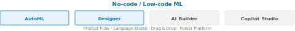

[⟵ Poprzedni: Glosariusz](09-glosariusz.md) | [Następny: Azure AI Vision ⟶](11-azure-ai-vision.md)

# 10. **No-code i low-code Machine Learning na Azure**

## Czym jest no-code/low-code ML?
- **No-code ML** to podejście, w którym budowanie, trenowanie i wdrażanie modeli uczenia maszynowego odbywa się bez pisania kodu programistycznego. Użytkownik korzysta z graficznego interfejsu (GUI), przeciąga i upuszcza komponenty (drag & drop), konfiguruje parametry i uruchamia procesy ML wizualnie.
- **Low-code ML** pozwala na minimalne użycie kodu, głównie do zaawansowanych konfiguracji lub automatyzacji.

## Zalety no-code/low-code ML
- Dostępność dla osób nietechnicznych i biznesowych
- Szybkie prototypowanie i testowanie pomysłów
- Automatyzacja powtarzalnych zadań ML
- Łatwe wdrażanie modeli do produkcji

## Ograniczenia
- Mniejsza elastyczność niż w pełnym kodowaniu
- Ograniczony dostęp do zaawansowanych opcji i niestandardowych algorytmów
- Często ograniczone możliwości debugowania

## Przykład: Azure Machine Learning Designer
- **Azure ML Designer** to narzędzie typu drag & drop dostępne w Azure Machine Learning.
- Pozwala budować pipeline'y ML, trenować modele, oceniać wyniki i wdrażać modele jako endpointy bez pisania kodu.
- Użytkownik wybiera gotowe moduły (np. wczytaj dane, podziel dane, wybierz algorytm, ocen model), łączy je graficznie i uruchamia eksperyment.

## Przykład: Automated ML (AutoML)
- **Automated ML** w Azure pozwala automatycznie wybrać najlepszy algorytm i parametry dla danego zadania ML.
- Użytkownik wskazuje dane, cel (np. klasyfikacja, regresja), a resztą zajmuje się platforma.
- Wynikowy model można wdrożyć jednym kliknięciem.

## Typowe zastosowania na egzaminie AI-900
- Klasyfikacja obrazów i tekstu bez kodowania
- Predykcja wartości liczbowych (regresja) na podstawie danych tabelarycznych
- Automatyczna analiza sentymentu
- Szybkie prototypowanie rozwiązań AI w biznesie

## Usługi Azure wspierające no-code/low-code ML
- **Azure Machine Learning Designer** – graficzne budowanie pipeline'ów ML (drag & drop)
- **Automated ML (AutoML)** – automatyczne trenowanie modeli (klasyfikacja, regresja, klasteryzacja, Computer Vision, NLP – Natural Language Processing)
- **Power Platform AI Builder** – narzędzia AI dla użytkowników biznesowych:
	- Klasyfikacja tekstu i obrazów
	- Wykrywanie obiektów
	- Predykcja wartości numerycznych
	- Analiza sentymentu
	- Przetwarzanie dokumentów (faktury, formularze)
	- Integracja z Power Apps i Power Automate
- **Microsoft Copilot Studio** (dawniej Power Virtual Agents) – platforma no-code do tworzenia chatbotów i agentów AI:
	- Budowa botów z użyciem generatywnej AI (GPT)
	- Łączenie z zewnętrznymi źródłami wiedzy
	- Integracja z Teams, stronami internetowymi, aplikacjami
- **Azure AI Foundry Prompt Flow** – wizualny edytor do budowy aplikacji AI opartych na LLM bez konieczności kodowania.
- **Azure AI Language Studio** – portal do trenowania i testowania modeli NLP (klasyfikacja tekstu, CLU, Question Answering) bez kodu.

[⟵ Poprzedni: Glosariusz](09-glosariusz.md) | [Następny: Azure AI Vision ⟶](11-azure-ai-vision.md)
