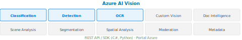

[⟵ Poprzedni: No-code i low-code ML](10-no-code-ml.md) | [Następny: Azure AI Face ⟶](12-azure-ai-face.md)

# Azure AI Vision




## Opis usługi
Azure AI Vision to kompleksowa usługa chmurowa umożliwiająca analizę obrazów i wideo. Pozwala na automatyczne rozpoznawanie obiektów, klasyfikację scen, wykrywanie tekstu (OCR), analizę twarzy oraz ekstrakcję metadanych z materiałów wizualnych. Usługa jest dostępna przez REST API, SDK oraz gotowe narzędzia w portalu Azure.

## Kluczowe funkcje
- **Klasyfikacja obrazów (Image Classification)** – rozpoznawanie, co znajduje się na zdjęciu (np. pies, produkt, scena).
- **Detekcja obiektów (Object Detection)** – lokalizowanie i oznaczanie wielu obiektów na obrazie ograniczającymi prostokątami (bounding boxes).
- **OCR (Optical Character Recognition)** – rozpoznawanie i ekstrakcja tekstu z obrazów, skanów, tablic rejestracyjnych.
- **Analiza sceny** – opisywanie sceny, generowanie tagów, kategorii i opisów w języku naturalnym.
- **Moderacja treści** – wykrywanie treści nieodpowiednich (przemoc, treści dla dorosłych).
- **Segmentacja obrazów (Image Segmentation)** – wyodrębnianie obszarów przynależących do różnych obiektów na poziomie pikseli.
- **Analiza przestrzenna (Spatial Analysis)** – zliczanie osób, śledzenie ruchu, strefy zainteresowania w wideo na żywo.
- **Ekstrakcja metadanych** – dominujące kolory, format, rozdzielczość.
- **Custom Vision** – trenowanie własnych modeli klasyfikacji i detekcji bez kodowania:
	- Wgrywanie i etykietowanie zdjęć
	- Trenowanie jednym kliknięciem
	- Eksport do Edge/ONNX/CoreML/TensorFlow Lite
	- Dostępne zadania: Image Classification, Object Detection
- **Azure AI Document Intelligence** (dawniej Form Recognizer) – ekstrakcja danych ze strukturyzowanych dokumentów:
	- Odczytywanie par klucz-wartość i tabel z formularzy
	- Gotowe modele: Invoice, Receipt, ID Document, Business Card, Tax
	- Własne modele na niestandardowych dokumentach

## Przykłady użycia (Use Cases)
- Automatyczna kategoryzacja zdjęć w aplikacjach e-commerce.
- Weryfikacja dokumentów tożsamości (OCR + analiza twarzy).
- Wykrywanie niepożądanych treści na platformach społecznościowych.
- Digitalizacja archiwów papierowych (OCR).
- Systemy bezpieczeństwa: wykrywanie osób, pojazdów, tablic rejestracyjnych.
- Analiza ruchu w sklepach (liczenie osób, heatmapy).

## Przykład implementacji (C#)
```csharp
// Przykład użycia Azure AI Vision w C#
using System;
using System.Net.Http;
using System.Net.Http.Headers;
using System.Text;
using System.Threading.Tasks;

class Program
{
	static async Task Main()
	{
		var endpoint = "https://<your-region>.api.cognitive.microsoft.com/vision/v3.2/analyze";
		var subscriptionKey = "<your-key>";
		var imageUrl = "https://example.com/image.jpg";

		using var client = new HttpClient();
		client.DefaultRequestHeaders.Add("Ocp-Apim-Subscription-Key", subscriptionKey);

		var requestParameters = "visualFeatures=Categories,Description,Objects,Tags";
		var uri = endpoint + "?" + requestParameters;
		var content = new StringContent($"{{\"url\":\"{imageUrl}\"}}", Encoding.UTF8, "application/json");

		var response = await client.PostAsync(uri, content);
		var result = await response.Content.ReadAsStringAsync();
		Console.WriteLine(result);
	}
}
```

## Ważne informacje
- Usługa obsługuje wiele języków i formatów obrazów.
- Możliwość trenowania własnych modeli (Custom Vision).
- Integracja z innymi usługami Azure (np. Logic Apps, Power Automate).
- Wysoka skalowalność i dostępność w regionach Azure.
- Rozliczanie za liczbę żądań lub czas przetwarzania.

---
[⟵ Poprzedni: No-code i low-code ML](10-no-code-ml.md) | [Następny: Azure AI Face ⟶](12-azure-ai-face.md)
