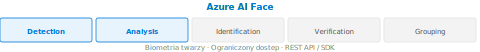

[⟵ Poprzedni: Azure AI Vision](11-azure-ai-vision.md) | [Następny: Azure AI Language ⟶](13-azure-ai-language.md)

# Azure AI Face



## Opis usługi
Azure AI Face to specjalistyczna usługa do wykrywania, analizy i rozpoznawania twarzy na obrazach i wideo. Umożliwia identyfikację osób, analizę emocji, określanie wieku, płci oraz porównywanie twarzy. Usługa jest szeroko wykorzystywana w systemach bezpieczeństwa, kontroli dostępu i personalizacji usług.

## Kluczowe funkcje
- **Wykrywanie twarzy** – lokalizowanie twarzy na zdjęciach i wideo.
- **Analiza cech twarzy** – określanie wieku, płci, emocji, zarostu, okularów, pozycji głowy.
- **Rozpoznawanie tożsamości** – identyfikacja osób na podstawie bazy referencyjnej (Face Identification).
- **Porównywanie twarzy** – sprawdzanie, czy dwie twarze należą do tej samej osoby (Face Verification).
- **Grupowanie twarzy** – automatyczne grupowanie podobnych twarzy.

## Przykłady użycia (Use Cases)
- Systemy kontroli dostępu (biometryczne wejście do budynków).
- Personalizacja reklam i usług na podstawie analizy demograficznej.
- Weryfikacja tożsamości w aplikacjach bankowych i rządowych.
- Analiza emocji klientów w sklepach lub podczas obsługi klienta.
- Automatyczne tagowanie zdjęć w galeriach i mediach społecznościowych.

## Przykład implementacji (C#)
```csharp
// Przykład użycia Azure AI Face w C#
using System;
using System.Net.Http;
using System.Net.Http.Headers;
using System.Text;
using System.Threading.Tasks;

class Program
{
	static async Task Main()
	{
		var endpoint = "https://<your-region>.api.cognitive.microsoft.com/face/v1.0/detect";
		var subscriptionKey = "<your-key>";
		var imageUrl = "https://example.com/photo.jpg";

		using var client = new HttpClient();
		client.DefaultRequestHeaders.Add("Ocp-Apim-Subscription-Key", subscriptionKey);

		var requestParameters = "returnFaceAttributes=age,gender,emotion";
		var uri = endpoint + "?" + requestParameters;
		var content = new StringContent($"{{\"url\":\"{imageUrl}\"}}", Encoding.UTF8, "application/json");

		var response = await client.PostAsync(uri, content);
		var result = await response.Content.ReadAsStringAsync();
		Console.WriteLine(result);
	}
}
```

## Ważne informacje
- Wysoka dokładność wykrywania i rozpoznawania twarzy.
- Obsługa zdjęć, wideo oraz strumieni na żywo.
- Możliwość tworzenia własnych baz referencyjnych osób (PersonGroup, LargePersonGroup).
- Zgodność z przepisami o ochronie danych osobowych (RODO/GDPR).
- **Ograniczony dostęp (Limited Access Policy)** – funkcje identyfikacji twarzy i weryfikacji tożsamości są dostępne tylko po formalnej akceptacji przez Microsoft. Wymagane uzasadnienie biznesowe.
- **Face Liveness Detection** – wykrywa próby wyłudzenia dostępu za pomocą zdjęć lub nagrań wideo (ochrona przed atakami typu „presentation attack”).
- **Responsible AI** – Microsoft ograniczył dostęp do niektórych funkcji (np. rozpoznawanie emocji jako wnioskowanie o stanie psychicznym), by zapobiec nadużyciom i dyskryminacji.
- Zakaz użycia do masowej, nieautoryzowanej inwigilacji osób publicznych.

---
[⟵ Poprzedni: Azure AI Vision](11-azure-ai-vision.md) | [Następny: Azure AI Language ⟶](13-azure-ai-language.md)
