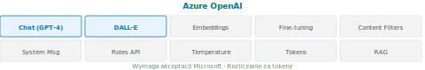

# Azure OpenAI


## Opis usługi
Azure OpenAI to usługa umożliwiająca dostęp do zaawansowanych modeli generatywnych, takich jak GPT (Generative Pre-trained Transformer), DALL-E (generowanie obrazów), Codex (generowanie kodu) oraz innych dużych modeli językowych. Usługa pozwala na integrację generatywnej AI z aplikacjami biznesowymi, automatyzację procesów, analizę tekstu, generowanie treści i wiele więcej.



## Kluczowe funkcje
- **Generowanie tekstu (Chat Completions)** – tworzenie odpowiedzi, podsumowań, artykułów, e-maili, kodu.
- **Generowanie obrazów (DALL-E)** – tworzenie grafik na podstawie opisu tekstowego (text-to-image).
- **Embeddings** – zamiana tekstu na wektory liczbowe do wyszukiwania semantycznego i porównywania treści.
- **Fine-tuning** – dostosowanie modelu GPT do własnego zbioru danych i stylu odpowiedzi.
- **RAG (Retrieval Augmented Generation)** – połączenie modelu z zewnętrzną bazą wiedzy (np. Azure AI Search) – model odpowiada na podstawie aktualnych dokumentów.
- **System Message** – konfiguracja roli i zachowania modelu na początku sesji.
- **Roles API** – trzy typy wiadomości: `system` (instrukcja), `user` (pytanie), `assistant` (odpowiedź modelu).
- **Content Filters** – wbudowane filtry treści blokujące szkodliwe wyniki (przemoc, mowa nienawiści, treści seksualne). Konfigurowalne przez administratora.
- **Tworzenie chatbotów** – budowa zaawansowanych asystentów konwersacyjnych.
- **Automatyzacja procesów** – generowanie dokumentów, odpowiedzi, wsparcie obsługi klienta.

## Przykłady użycia (Use Cases)
- Automatyczne generowanie treści marketingowych i raportów.
- Tworzenie chatbotów i asystentów AI dla stron internetowych i aplikacji.
- Generowanie kodu na podstawie opisu (np. SQL, Python).
- Tworzenie obrazów do prezentacji, reklam, mediów społecznościowych.
- Wsparcie analizy dokumentów i ekstrakcji danych.

## Przykład implementacji (Python, REST API)
```csharp
// Przykład użycia Azure OpenAI (Chat Completion) w C#
using System;
using System.Net.Http;
using System.Text;
using System.Threading.Tasks;

class Program
{
    static async Task Main()
    {
        var endpoint = "https://<your-resource-name>.openai.azure.com/openai/deployments/gpt-35-turbo/chat/completions?api-version=2023-05-15";
        var apiKey = "<your-key>";

        using var client = new HttpClient();
        client.DefaultRequestHeaders.Add("api-key", apiKey);

        var json = "{\"messages\":[{\"role\":\"user\",\"content\":\"Wygeneruj podsumowanie tego tekstu...\"}]}";
        var content = new StringContent(json, Encoding.UTF8, "application/json");

        var response = await client.PostAsync(endpoint, content);
        var result = await response.Content.ReadAsStringAsync();
        Console.WriteLine(result);
    }
}
```

## Ważne informacje
- Wymaga utworzenia zasobu Azure OpenAI i **uzyskania dostępu (wymaga akceptacji Microsoft)**.
- Obsługa modeli: **GPT-4**, **GPT-4o**, **GPT-3.5 Turbo**, **DALL-E 3**, **text-embedding-ada** i innych.
- **Fine-tuning** – możliwość dostosowania modeli GPT-3.5 i GPT-4 do własnych danych.
- Rozliczanie za **tokeny** (input + output) lub za generowane obrazy.
- **Content Filters (filtry treści)** są aktywne domyślnie i można konfiguować ich czułość.
- **Prompt Injection** – ryzyko bezpieczeństwa polegające na wstrzyknięciu instrukcji przez dane wejściowe – należy sanityzować dane.
- Integracja z innymi usługami Azure: Logic Apps, Power Automate, Azure AI Search (do RAG).
- Wymagania dotyczące bezpieczeństwa i zgodności z regulacjami (RODO, GDPR, HIPAA).
- Dostępność w wybranych regionach Azure.

---
[⟵ Powrót do spisu treści](README.md)
