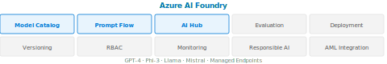

[⟵ Poprzedni: Azure OpenAI](15-azure-openai.md) | [Następny: Azure Machine Learning ⟶](17-azure-machine-learning.md)

# Azure AI Foundry




## Opis usługi
Azure AI Foundry to platforma do zarządzania, katalogowania i wdrażania modeli AI w środowisku Azure. Umożliwia organizacjom centralne przechowywanie modeli, zarządzanie ich wersjami, udostępnianie modeli zespołom oraz monitorowanie ich wykorzystania i wydajności. Foundry wspiera zarówno modele własne, jak i modele open source oraz komercyjne.

## Kluczowe funkcje
- **Katalog modeli (Model Catalog)** – centralna baza modeli AI: modele Microsoft (GPT-4, Phi-3), open source (Llama, Mistral, Falcon), modele partnerów. Umożliwia przeglądanie, ewaluację i szybkie wdrażanie.
- **Prompt Flow** – narzędzie do orkiestracji przepływów AI: budowa pipeline’ów łączących LLM, narzędzia, retrieval i logikę. Używane do RAG i wielostopniowych aplikacji AI.
- **AI Hub i AI Project** – środowisko pracy zespołowej: zarządzanie połączeniami, zasobami, dostępem i eksperymentami.
- **Ewaluacja modeli (Evaluation)** – porównywanie jakości modeli i promptów na własnych danych testowych (metryki: coherence, groundedness, fluency, relevance).
- **Wersjonowanie modeli** – śledzenie zmian i historii modeli.
- **Wdrażanie modeli** – szybkie publikowanie modeli jako endpointy REST API (managed online endpoints).
- **Zarządzanie dostępem** – kontrola RBAC, kto może korzystać z danego modelu lub projektu.
- **Monitorowanie wydajności** – analiza wykorzystania, skuteczności i błędów modeli po wdrożeniu.
- **Integracja z Azure Machine Learning** – płynne wdrażanie i zarządzanie cyklem życia modeli (MLOps).
- **Responsible AI** – wbudowane dashboardy Responsible AI, content safety i ewaluacja fairness.

## Przykłady użycia (Use Cases)
- Udostępnianie modeli AI zespołom deweloperskim i analitycznym.
- Zarządzanie cyklem życia modeli w dużych organizacjach.
- Monitorowanie skuteczności modeli wdrożonych w produkcji.
- Szybkie wdrażanie modeli open source do środowiska chmurowego.
- Zapewnienie zgodności i bezpieczeństwa modeli AI.

## Przykład implementacji (C#)
```csharp
// Rejestracja modelu i publikacja endpointu w Azure ML za pomocą C#
using Azure.AI.MachineLearning;
using Azure.AI.MachineLearning.Models;
using Azure.Identity;

var credential = new DefaultAzureCredential();
var mlClient = new MachineLearningClient(
	new Uri("https://<your-workspace-name>.<region>.ml.azure.com"),
	credential);

// Rejestracja modelu
var model = new Model(
	name: "my-model",
	path: "./model.pkl"
);
mlClient.Models.CreateOrUpdate(model);

// Publikacja modelu jako endpoint
var endpoint = new OnlineEndpoint(
	name: "my-endpoint",
	description: "Endpoint dla modelu AI"
);
mlClient.OnlineEndpoints.CreateOrUpdate(endpoint);
```

## Ważne informacje
- Ułatwia zarządzanie dużą liczbą modeli w organizacji.
- Wspiera standardy MLOps i automatyzację wdrożeń.
- Integracja z narzędziami CI/CD i monitorowaniem.
- Zapewnia zgodność z regulacjami i bezpieczeństwo danych.
- Rozliczanie za wykorzystanie zasobów i liczbę endpointów.

---
[⟵ Poprzedni: Azure OpenAI](15-azure-openai.md) | [Następny: Azure Machine Learning ⟶](17-azure-machine-learning.md)
