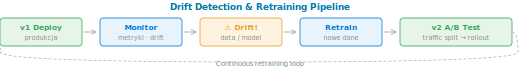

[⟵ Poprzedni: Azure AI Foundry](16-azure-ai-foundry.md)

# Azure Machine Learning


## Opis usługi
Azure Machine Learning (Azure ML) to kompleksowa platforma do budowy, trenowania, wdrażania i zarządzania modelami uczenia maszynowego w chmurze. Umożliwia zarówno pracę no-code/low-code (Designer, AutoML), jak i zaawansowane projekty kodowane w Pythonie. Wspiera cały cykl życia ML, automatyzację, MLOps i integrację z innymi usługami Azure.

## Kluczowe funkcje
- **Projektowanie pipeline'ów ML (Designer)** – graficzny interfejs drag & drop do budowy procesów ML bez kodowania.
- **Automated ML (AutoML)** – automatyczne dobieranie algorytmów i hiperparametrów. Obsługuje klasyfikację, regresję, klasteryzację, szeregi czasowe, Computer Vision i NLP.
- **Trenowanie modeli** – obsługa frameworków: scikit-learn, PyTorch, TensorFlow, XGBoost.
- **Wdrażanie modeli** – publikacja jako REST endpointy: **Managed Online Endpoint** (real-time), **Batch Endpoint** (wsadowe).
- **Monitorowanie i rejestracja modeli (Model Registry)** – wersjonowanie, śledzenie metryk, audyt.
- **Zarządzanie danymi (Data Assets)** – rejestracja, wersjonowanie i przetwarzanie zbiorów danych.
- **Compute clusters i compute instances** – klastry do trenowania (skalowalne) i instancje do dewelopmentu/notebooków.
- **Data Labeling** – narzędzie do etykietowania danych (obrazy, tekst) z opcją asysty ML.
- **MLOps** – automatyzacja wdrożeń ML: integracja z GitHub, Azure DevOps, CI/CD dla modeli ML.
- **Responsible AI Dashboard** – kompleksowy panel do analizy modeli pod kątem:
	- **Fairness** (wykrywanie dyskryminacji między grupami)
	- **Error Analysis** (analiza błędów modelu)
	- **Explainability** (SHAP, LIME – wyjaśnienie decyzji modelu)
	- **Data Explorer** (eksploracja danych wejściowych)
	- **Causal Analysis** (przyczynowość i kontrfaktualne przykłady)
- **Feature Store** – centralne repozytorium cech ML do ponownego wykorzystania między projektami.
- **Environments** – zarządzanie środowiskami Python (kontenery Docker) do reprodukowalnego trenowania.

## Przykłady użycia (Use Cases)
- Budowa modeli predykcyjnych dla finansów, sprzedaży, produkcji.
- Automatyzacja analizy danych i raportowania.
- Szybkie prototypowanie rozwiązań AI przez osoby nietechniczne (Designer).
- Wdrażanie modeli do aplikacji biznesowych i API.
- Monitorowanie jakości i wydajności modeli w produkcji.

## Przykład implementacji (C#)
```csharp
// Przykład użycia Azure Machine Learning SDK w C#
using Azure.AI.MachineLearning;
using Azure.AI.MachineLearning.Models;
using Azure.Identity;

var credential = new DefaultAzureCredential();
var mlClient = new MachineLearningClient(
	new Uri("https://<your-workspace-name>.<region>.ml.azure.com"),
	credential);

// Załaduj dane, zdefiniuj eksperyment, wytrenuj model
// ...

// Publikacja modelu jako endpoint
var endpoint = new OnlineEndpoint(
	name: "my-endpoint",
	description: "Endpoint dla modelu AI"
);
mlClient.OnlineEndpoints.CreateOrUpdate(endpoint);
```

## Monitorowanie modeli w produkcji – drift detection



- **Model Monitoring (Zlecenia/MLOps)** – ciągłe śledzenie wydajności wdrożonego modelu:
	- **Real-time metrics**: latency (czas odpowiedzi), throughput (liczba żądań), error rate.
	- **Data drift**: zmiana rozkładu danych wejściowych w czasie (np. zmiana profilu użytkownika). Model wytrenowany na starych danych może działać gorzej.
	- **Model drift**: pogorszenie się wydajności metryki predykcyjnej (accuracy, precision, recall) na nowych danych.
	- **Prediction drift**: nagła zmiana przewidywań modelu (bez zmiany danych wejściowych).
- **Scenariusz problemu**:
  - Wytrenowałeś model kredytowy w 2024 na danych klientów głównie międzywiekowych).
  - W 2025 pojawia się nowa demografika (starsze osoby starają się o kredyty).
  - Model zaczyna źle przewidywać dla nowych grup → **DATA DRIFT**.
  - Trzeba retrenować model na nowych danych.

## Model Versioning & Retraining Strategy
- **Model Registry** – wszystkie wersje modelu w jednym miejscu:
  - Każda wersja ma metadane: autor, data, metryki testowe, parametry.
  - Łatwe zarządzanie: promowania starego modelu, rollback'u, porównania wersji.
- **Retraining Pipeline**:
  1. Zbierz nowe dane w produkcji (co tydzień, miesiąc).
  2. Uruchom eksperyment ML (AutoML lub custom trening) na nowych danych.
  3. Porównaj metryki nowego modelu ze starym.
  4. Jeśli nowy jest lepszy: A/B test (traffic split) i postupniowy rollout.
  5. Jeśli gorzej: pozostań przy starym, zbierz więcej danych.
- **Azure ML Schedules**: automatyzacja retrainingu – co miesiąc uruchom pipeline, przetrenuj, oceń, potencjalnie wdróż.

## Integracja z DevOps (MLOps)
- **CI/CD dla modeli**: GitHub Actions / Azure DevOps → automatyczne testy, budowanie, wdrażanie nowych wersji modelu.
- **Reproducibility**: Environment + seedy kodów = powtarzalne wyniki treningu.
- **Audit trail**: kto trenował model, kiedy, z jakimi danymi, jakie były wyniki.

## Ważne informacje
- Obsługa pracy zespołowej i zarządzania uprawnieniami.
- Integracja z GitHub, Azure DevOps, Power BI.
- Wsparcie dla MLOps, automatyzacji i monitorowania.
- Możliwość pracy w trybie no-code, low-code i full-code.
- Rozliczanie za wykorzystane zasoby obliczeniowe i przechowywanie danych.

---
[⟵ Poprzedni: Azure AI Foundry](16-azure-ai-foundry.md)
